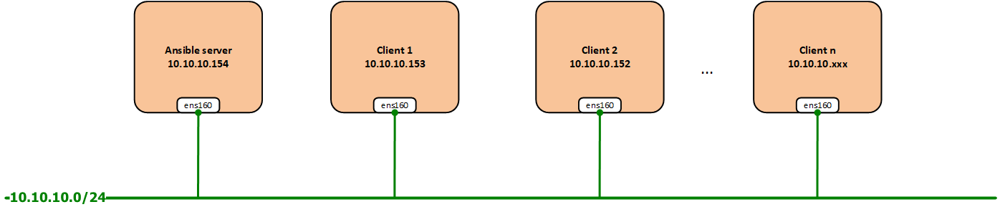

## Setup ansible CentOS 7

- Mô hình



- Cài đặt

```
yum install epel-release -y
yum install ansible -y
```

```
ansible --version
```

- Chỉnh sửa inventory khai báo các host client được quản lý bởi ansible server

```
vi /etc/ansible/hosts
```

```
[ops]
10.10.10.117
10.10.10.118
10.10.10.119
10.10.10.120

[node]
10.10.10.152
10.10.10.153
~

"/etc/ansible/hosts" 47L, 1049C
```

- Sử dụng key-pair để kết nối tới client, tạo key và chuyển key tới client

**Gen key**

```
ssh-keygen -b 521 -t ecdsa
```

```
[root@ansibleserver ~]# ssh-keygen -b 521 -t ecdsa
Generating public/private ecdsa key pair.
Enter file in which to save the key (/root/.ssh/id_ecdsa):
Created directory '/root/.ssh'.
Enter passphrase (empty for no passphrase):
Enter same passphrase again:
Your identification has been saved in /root/.ssh/id_ecdsa.
Your public key has been saved in /root/.ssh/id_ecdsa.pub.
The key fingerprint is:
SHA256:6TJRLKZpCyiOHh0vaITVW51+qmtDYyRoeyTVd7le4jg root@ansibleserver
The key's randomart image is:
+---[ECDSA 521]---+
|     .     .     |
|   .. .o..o      |
|  .o. +.=. .     |
|.o+ o*.+ .o .    |
|+o.==o. S+.o     |
|= +o+.+oEoo      |
|.= +.+o.o.       |
|o . . o+         |
| .   .oo         |
+----[SHA256]-----+
```

**Chuyển key tới client**

```
ssh-copy-id root@10.10.10.152
ssh-copy-id root@10.10.10.153
```

```
[root@ansibleserver ~]# ssh-copy-id root@10.10.10.152
/usr/bin/ssh-copy-id: INFO: Source of key(s) to be installed: "/root/.ssh/id_ecdsa.pub"
The authenticity of host '10.10.10.152 (10.10.10.152)' can't be established.
ECDSA key fingerprint is SHA256:euGQ+BQggToU1j5j8b5Unh5c7FD+k7x/uUHgJqfM52s.
ECDSA key fingerprint is MD5:a7:9a:86:5b:6a:10:e7:b6:aa:3f:2e:93:35:93:59:6c.
Are you sure you want to continue connecting (yes/no)? yes
/usr/bin/ssh-copy-id: INFO: attempting to log in with the new key(s), to filter out any that are already installed
/usr/bin/ssh-copy-id: INFO: 1 key(s) remain to be installed -- if you are prompted now it is to install the new keys
root@10.10.10.152's password:

Number of key(s) added: 1

Now try logging into the machine, with:   "ssh 'root@10.10.10.152'"
and check to make sure that only the key(s) you wanted were added.
```

**Test ssh tới client không cần nhập pass*

```
[root@ansibleserver ~]# ssh 10.10.10.152
Last login: Thu Jul 25 09:50:53 2019 from gateway
[root@ansible10152 ~]#
```

- Test

Đứng từ ansible server kiếm tra `ping` tới các client xem có ok hay không

```
ansible all -m ping
```
Giải thích câu lệnh: sử dụng ansible dùng module ping thực hiện tới tất cả các host, group đã được khai báo trong inventory.

Kết quả

```
[root@ansibleserver ~]# ansible all -m ping
10.10.10.153 | SUCCESS => {
    "ansible_facts": {
        "discovered_interpreter_python": "/usr/bin/python"
    },
    "changed": false,
    "ping": "pong"
}
10.10.10.152 | SUCCESS => {
    "ansible_facts": {
        "discovered_interpreter_python": "/usr/bin/python"
    },
    "changed": false,
    "ping": "pong"
}
[root@ansibleserver ~]#
```

```
ansible ops -m ping
```
Giải thích câu lệnh: sử dụng ansible dùng module ping thực hiện tới tất cả các host trong group `ops` đã được khai báo trong inventory.

```
[root@ansibleserver ~]# ansible ops -m ping
10.10.10.117 | SUCCESS => {
    "ansible_facts": {
        "discovered_interpreter_python": "/usr/bin/python"
    },
    "changed": false,
    "ping": "pong"
}
10.10.10.120 | SUCCESS => {
    "ansible_facts": {
        "discovered_interpreter_python": "/usr/bin/python"
    },
    "changed": false,
    "ping": "pong"
}
10.10.10.118 | SUCCESS => {
    "ansible_facts": {
        "discovered_interpreter_python": "/usr/bin/python"
    },
    "changed": false,
    "ping": "pong"
}
10.10.10.119 | SUCCESS => {
    "ansible_facts": {
        "discovered_interpreter_python": "/usr/bin/python"
    },
    "changed": false,
    "ping": "pong"
}
```


