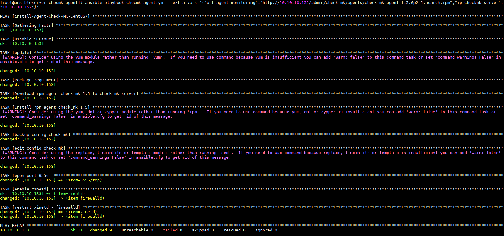
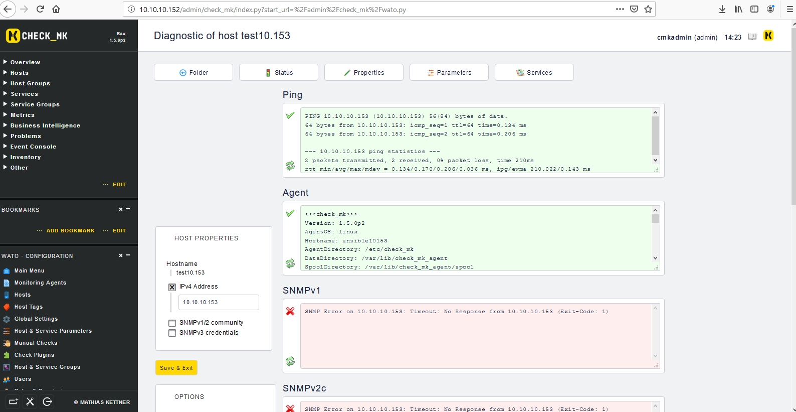
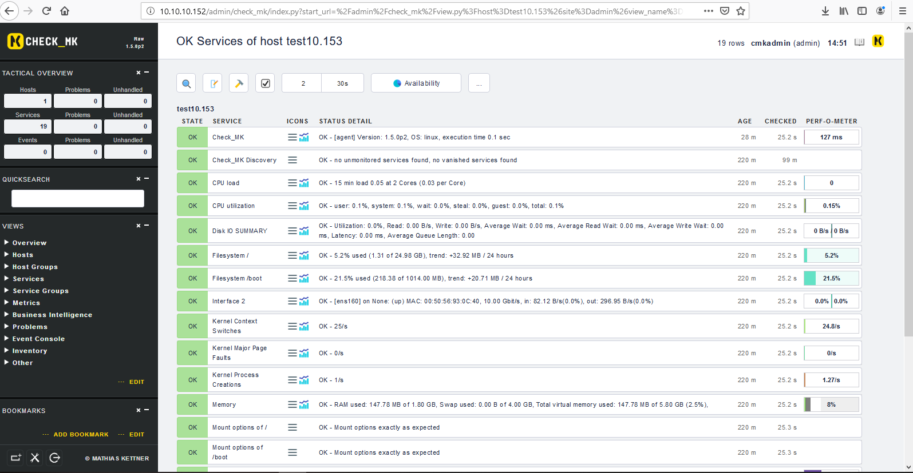

## Run play-books CHECKMK_SERVER

```
ansible-playbook checmk-agent.yml --extra-vars '{"url_agent_monitoring":"http://10.10.10.152/admin/check_mk/agents/check-mk-agent-1.5.0p2-1.noarch.rpm","ip_checkmk_server":"10.10.10.152"}'
```




## Check 



