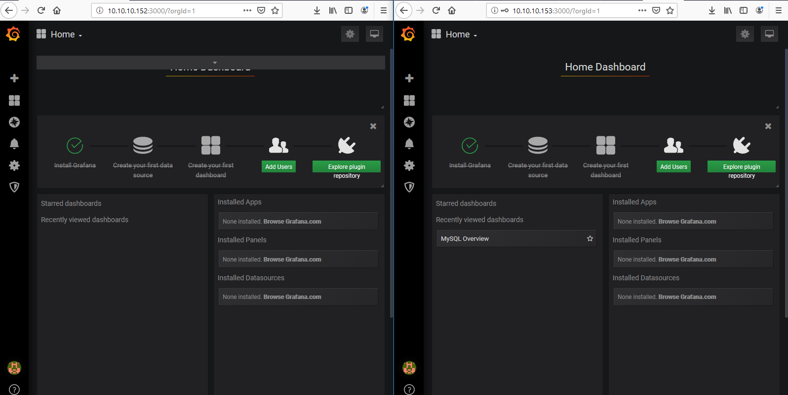

## Run play-books install grafana-server, add datasource. import file .json chuẩn.

```
ansible-playbook install-grafana62-c7.yml --extra-vars '{"pass_admin":"123456aA"}'
```


## Check 

```
http://ip-server:3000/
```




