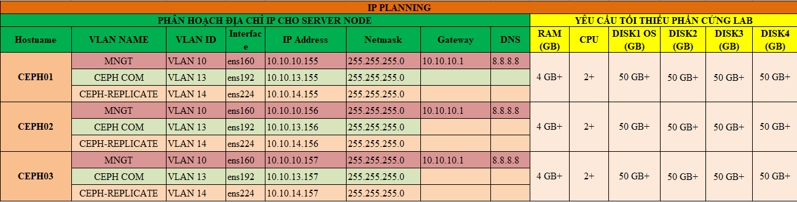

# Ghi chép lại các bước cài đặt CEPH phiên bản luminous

### Mục lục

[1. Mô hình triển khai](#mohinh)<br>
[2. IP Planning](#planning)<br>
[3. Thiết lập ban đầu](#thietlap)<br>
[4. Cài đặt](#caidat)<br>
[5. Khởi tạo MGR](#mgr)<br>
[6. Khởi tạo OSD](#osd)<br>


<a name="mohinh"></a>
## 1. Mô hình triển khai

Mô hình triển khai gồm 3 node CEPH mỗi node có 3 OSDs.


**OS** : CentOS7 - 64 bit<br>
**Disk**: 04 HDD, trong đó 01sử dụng để cài OS, 03 sử dụng làm OSD (nơi chứa dữ liệu của client) <br>
**NICs**:
	ens160: dùng để ssh và tải gói cài đặt
	ens192: dùng để các trao đổi thông tin giữa các node Ceph, cũng là đường Client kết nối vào
	ens224: dùng để đồng bộ dữ liệu giữa các OSD
**Phiên bản cài đặt**: Ceph luminous

<a name="planning"></a>
## 2. IP Planning



<a name="thietlap"></a>
## 3. Thiết lập ban đầu

**Update**

```
yum install epel-release -y
yum update -y
```

**Cấu hình IP**

Thực hiện trên 3 node với IP đã được quy hoạch cho các node ở mục 2.

```
nmcli c modify ens160 ipv4.addresses 10.10.10.155/24
nmcli c modify ens160 ipv4.gateway 10.10.10.1
nmcli c modify ens160 ipv4.dns 8.8.8.8
nmcli c modify ens160 ipv4.method manual
nmcli con mod ens160 connection.autoconnect yes

nmcli c modify ens192 ipv4.addresses 10.10.13.155/24
nmcli c modify ens192 ipv4.method manual
nmcli con mod ens192 connection.autoconnect yes

nmcli c modify ens224 ipv4.addresses 10.10.14.155/24
nmcli c modify ens224 ipv4.method manual
nmcli con mod ens224 connection.autoconnect yes

sudo systemctl disable firewalld
sudo systemctl stop firewalld
sudo systemctl disable NetworkManager
sudo systemctl stop NetworkManager
sudo systemctl enable network
sudo systemctl start network
sed -i 's/SELINUX=enforcing/SELINUX=disabled/g' /etc/sysconfig/selinux
sed -i 's/SELINUX=enforcing/SELINUX=disabled/g' /etc/selinux/config
```


**Kiểm tra đủ disk trên các node CEPH**


**Bổ sung file hosts**

Thực hiện trên 3 node CEPH.

```
cat << EOF >> /etc/hosts
10.10.13.155 ceph01
10.10.13.156 ceph02
10.10.13.157 ceph03
EOF
```

