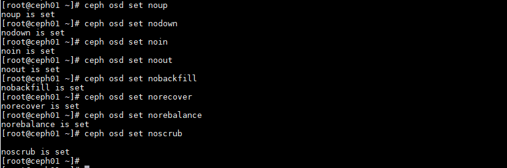
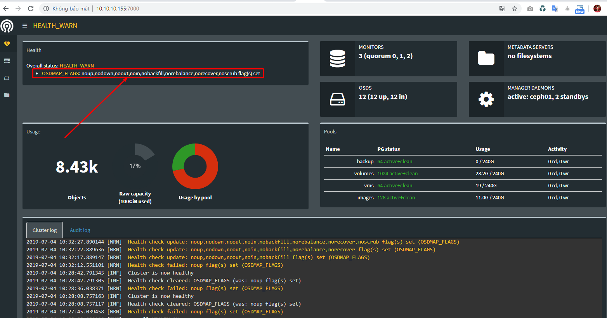
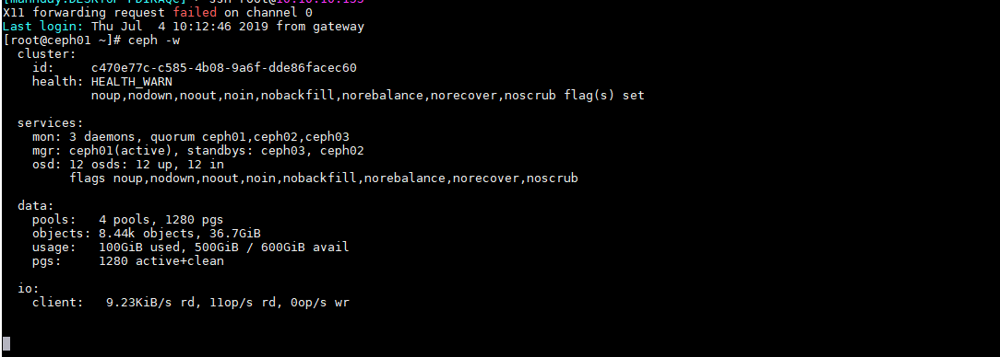
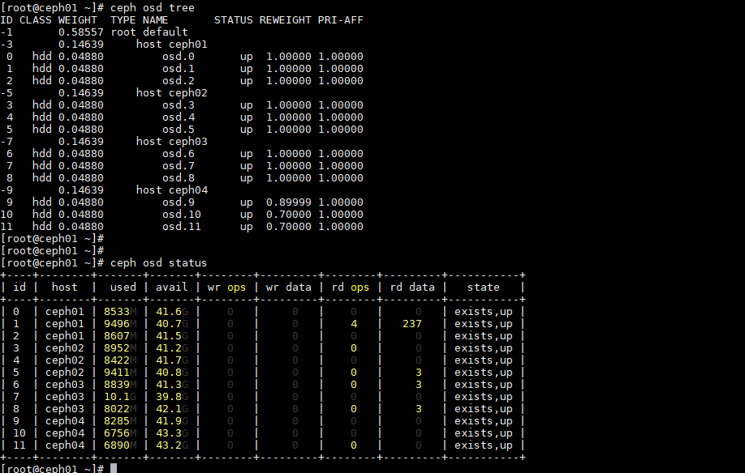
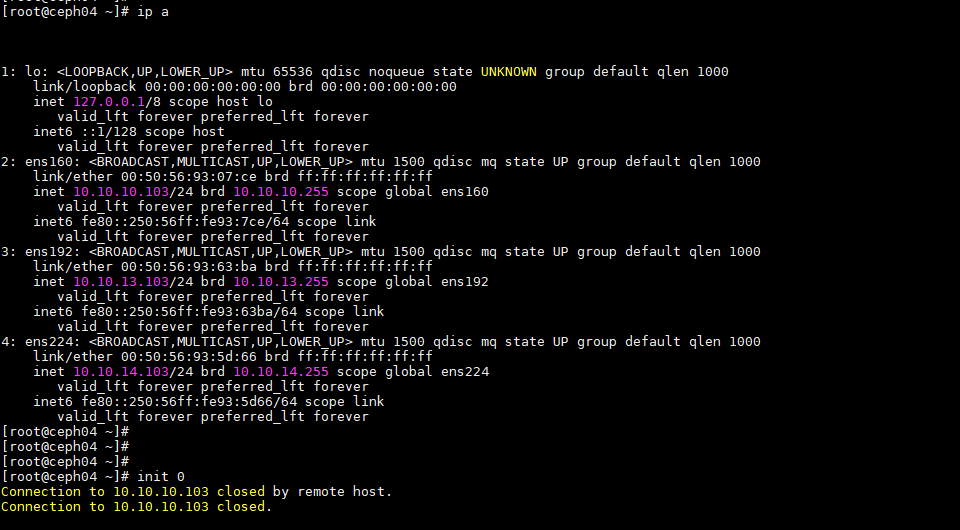
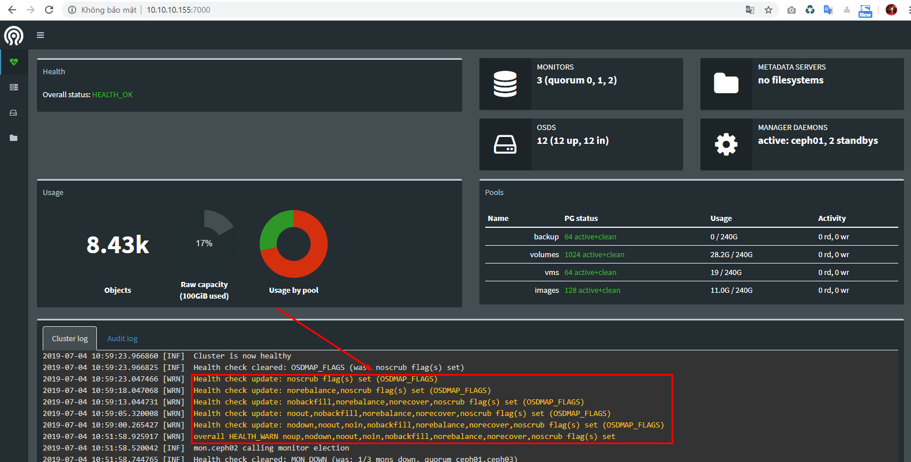

# Ghi chép về việc set flag trong CEPH Cluster

## 1. Flag

Flag có thể hiểu là các cờ gán cho một OSD trong ceph để xác định sự thay đổi trạng thái của đối tượng đó khi có sự thay đổi mà không ảnh hưởng tới hệ thống. Ta thường có sử dụng flag cho 2 đối tượng `OSDMAP_FLAGS`, `OSD_FLAGS`. Khi chủ động thao tác với cụm CEPH thì ta nên set flags để chủ động xử lý hệ thống.

Set flags là áp dụng cho toàn bộ cụm CEPH cluster nếu không chỉ định cho từng OSD cụ thể.

### 1.1. OSDMAP_FLAGS

Có thể đặt 1 hoặc nhiều flags cũng một lúc tác động lên toàn bộ osd maps trong cluster.

- **full**: cluster được set cờ biểu thị trạng thái `full` và không thể thực hiện được hành động ghi.
- **pauserd, pausewr**: Tạm dừng đọc, ghi đối với cluster.
- **noup**: OSDs không được cho phép thao tác cho đến khi up, sự kiện một osd nào đó up lên quá trình rebalance không diễn ra đến khi unset lại.
- **nodown**: Các OSD được báo cáo là lỗi sẽ bị bỏ qua, như vậy sẽ không thông báo cảnh báo OSDs down và cảnh báo trạng thái CEPH thay đổi.
- **noin** - Các OSD đã được đánh dấu là `out` trước đó sẽ không được đánh dấu là `in` cho đến khi start trở lại.
- **noout**: OSD down sẽ không được tự động đánh dấu trong khoảng thời gian cấu hình, không tự động set OSD out ra khỏi cluster, không cho phép OSD join vào CRUSHMAP khi OSD này start.
- **nobackfill, norecover, norebalance**: Tính năng recovery hoặc data rebalancing sẽ tạm dừng.
- **noscrub, nodeep_scrub** - scrubbing sẽ bị tắt.
- **notieragent** - cache tiering activity bị tắt.

```
ceph osd set <flag>
ceph osd unset <flag>
```

Ví dụ:

```
ceph osd set full
ceph osd unset full
```

```
ceph osd set noout,noin
ceph osd set noin
ceph osd unset noout,noin
ceph osd unset noin
```

### 1.2. OSD_FLAGS

Một hoặc nhiều OSDs hoặc CRUSH {nodes,device classes} có một hoặc một số flags cần thiết. Bao gồm các flags sau đây:

- **noup**: OSDs không được cho phép thao tác cho đến khi up, sự kiện một osd nào đó up lên quá trình rebalance không diễn ra đến khi unset lại.
- **nodown**: Các OSD được báo cáo là lỗi sẽ bị bỏ qua.
- **noin**: Các OSD đã được đánh dấu là `out` trước đó sẽ không được đánh dấu là `in` cho đến khi start trở lại.
- **noout**: OSD down sẽ không được tự động đánh dấu trong khoảng thời gian cấu hình.

```
ceph osd set-group noup,noout osd.0 osd.1
ceph osd unset-group noup,noout osd.0 osd.1
ceph osd set-group noup,noout host-foo
ceph osd unset-group noup,noout host-foo
ceph osd set-group noup,noout class-hdd
ceph osd unset-group noup,noout class-hdd
```
## 2. Áp dụng

- Down node Ceph bảo trì, nâng cấp

- Không cho phép thực hiện 1 task nào đó (scrub) trên cụm Ceph.

### Thực hiện down 1 node CEPH để bảo trì

- Về lý thuyết khi không tác động gì thì một node CEPH down hệ thống sẽ cảnh báo `warning` và quá trình `rebalance` data sẽ diến ra bây giờ ta set flags để down 1 node CEPH xuống mà không có cảnh báo waring và quá trình `rebalance` data không diễn ra cho tới khi up lại node (nếu có data phát sinh sẽ rebalance theo thuật toán của CEPH).

Set các flag không có thông báo thay đổi trạng thái CEPH cluster khi OSDs down và OSD up, trạng thái out/in join cluster, không cho phép `backfill`, `recovery`, `rebalance` 

```
ceph osd set noup 
ceph osd set nodown
ceph osd set noin
ceph osd set noout
ceph osd set nobackfill
ceph osd set norecover
ceph osd set norebalance
ceph osd set noscrub
```







+ Trước khi down 1 node ceph



+ Thực hiện down 1 node Ceph



Kiểm tra cụm ceph quá trình `rebalance` không diễn ra, cụm ceph không có cảnh báo `osd` hay node `down`.

+ Sau khi down 1 node CEPH

Bỏ flags đã set

```
ceph osd unset noup 
ceph osd unset nodown
ceph osd unset noin
ceph osd unset noout
ceph osd unset nobackfill
ceph osd unset norecover
ceph osd unset norebalance
ceph osd unset noscrub
```



Quá trình down node bảo trì không có ghi thêm data xuống nên không xảy ra `rebalance` vào các OSDs ở node down.


