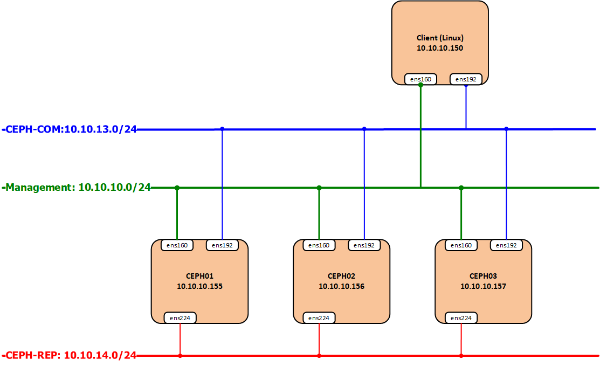

# Bài lab kết nối ceph client - ceph cluster

[1. Mô hình triển khai](#mohinh)<br>
[2. Các bước thực hiện](#thuchien)<br>

<a name="mohinh"></a>
## 1. Mô hình triển khai



- CEPH cluster
**OS** : CentOS7 - 64 bit<br>
**Disk**: 04 HDD, trong đó 01 sử dụng để cài OS, 03 sử dụng làm OSD (nơi chứa dữ liệu của client) <br>

- Yêu cầu: Khởi tạo một image (phần vùng disk VM) từ CEPH server xuống cho client Linux.

<a name="thuchien"></a>
## 2. Các bước thực hiện

### Bước 1: Tính toán chỉ số `replicate`, `PG` tạo một pool image

Đứng trên node CEPH để thực hiện:

+ Truy cập trang tính toán tự động số `PG` dựa trên thông tin hệ thống đã có.

```
https://ceph.com/pgcalc/
```


+ Mở file command được tự động tạo và tải về.


### Bước 2: Từ ceph server tạo 1 images (disk cho VM)

```
rbd create {pool-name}/{images} --size {size}
```

```
rbd create images/vol2 --size 15G
```

```
rbd info {pool-name}/{images}
```

```
rbd info images/vol2
```


### Bước 3: Cài đặt CEPH client trên client linux

- Trên client cài đặt ceph client

```
yum install ceph-common -y 
```

- Trên client download ceph.conf và key về /etc/ceph/

```
scp root@10.10.10.155:/etc/ceph/ceph.conf /etc/ceph/
scp root@10.10.10.155:/etc/ceph/{key-name}.keyring /etc/ceph/
```

```
scp root@10.10.10.155:/etc/ceph/ceph.conf /etc/ceph/
scp root@10.10.10.155:/etc/ceph/ceph.client.admin.keyring /etc/ceph/
```

{key-name}: Check ở ceph server


- Add config vào rbdmap trên ceph client

```
echo "{pool-name}/{images}            id=admin,keyring=/etc/ceph/ceph.client.admin.keyring" >> /etc/ceph/rbdmap
```

```
echo "images/vol2           id=admin,keyring=/etc/ceph/ceph.client.admin.keyring" >> /etc/ceph/rbdmap
```


- Kiểm tra 

```
sudo modprobe rbd
rbd feature disable {pool-name}/{images}  exclusive-lock object-map fast-diff deep-flatten
systemctl start rbdmap && systemctl enable rbdmap
```

```
sudo modprobe rbd
rbd feature disable images/vol2  exclusive-lock object-map fast-diff deep-flatten
systemctl start rbdmap && systemctl enable rbdmap
```


- Trên client xuất hiện phân cùng `rbd0` phân phối tự ceph server xuống có dung lượng 15 GB.


### Bước 3: Mount phân vùng mới theo

- Kiểm tra các phân vùng đang được gắn trên VM

```
fdisk -l
```


```
fdisk /dev/rbd0
```

```
m : xem hướng dẫn
		n : new partition
		p : primary
		default Partition number
		default First sector
		w :  Ghi lại thay đổi vào đĩa.
```


- Kiểm tra lại bằng `fdisk -l`


```
mkfs.ext4 /dev/rbd0p1
mkdir /data
mount /dev/rbd0p1 /data/
```


- Sửa trong fstab

Check id `blkid` để lấy ID.


```
echo "UUID=bfdf0e00-1d73-4bd9-a43e-32c408dbfdc9 /data ext4 noauto 0 0" >> /etc/fstab
```

**Lưu ý**: Để tạo được thư mục theo kiểu LVM  phải chỉnh sửa filter
```
vi /etc/lvm/lvm.conf
```
`
+ Thêm dòng config sau vào đoạn dòng `142`

```
types = [ "rbd", 1024 ]
filter = [ "r|/dev/sdb1|", "r|/dev/disk/|", "r|/dev/block/|", "a/.*/" ]
```


+ Thực hiện các lệnh tạo LVM


