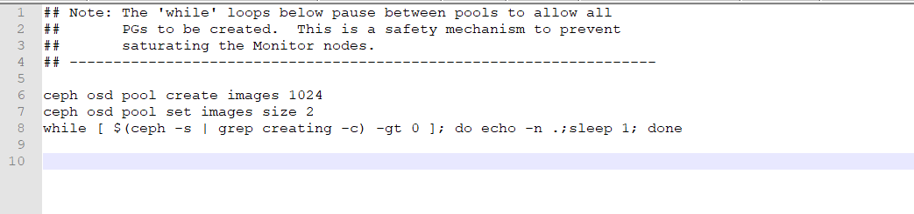

# Bài lab kết nối ceph client - ceph cluster

[1. Mô hình triển khai](#mohinh)<br>
[2. Các bước thực hiện](#thuchien)<br>

<a name="mohinh"></a>
## 1. Mô hình triển khai


- CEPH cluster
**OS** : CentOS7 - 64 bit<br>
**Disk**: 04 HDD, trong đó 01 sử dụng để cài OS, 03 sử dụng làm OSD (nơi chứa dữ liệu của client) <br>

- Yêu cầu: Khởi tạo một image (phần vùng disk VM) từ CEPH server xuống cho client Linux.

<a name="thuchien"></a>
## 2. Các bước thực hiện

### Bước 1: Tính toán chỉ số `replicate`, `PG` tạo một pool image

Đứng trên node CEPH để thực hiện:

+ Truy cập trang tính toán tự động số `PG` dựa trên thông tin hệ thống đã có.

```
https://ceph.com/pgcalc/
```


+ Mở file command được tự động tạo và tải về.




[](../images/client-cluster-linux/Screenshot_1628.png)


