# Bài lab kết nối ceph client - ceph cluster

[1. Mô hình triển khai](#mohinh)<br>
[2. IP Planning](planning)<br>
[3. Các bước thực hiện](#thuchien)<br>
[4. Extend volume](#extend)<br>


<a name="mohinh"></a>
## 1. Mô hình triển khai


- CEPH cluster
**OS** : CentOS7 - 64 bit<br>
**Disk**: 04 HDD, trong đó 01 sử dụng để cài OS, 03 sử dụng làm OSD (nơi chứa dữ liệu của client) <br>

- Yêu cầu: Khởi tạo một image (phần vùng disk VM) từ CEPH server xuống cho client Linux.

<a name="planning"></a>
## 2. IP Planning

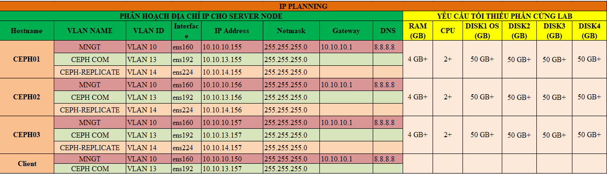

<a name="thuchien"></a>
## 3. Các bước thực hiện

### Bước 1: Tính toán chỉ số `replicate`, `PG` tạo một pool image

Đứng trên node CEPH để thực hiện:

+ Truy cập trang tính toán tự động số `PG` dựa trên thông tin hệ thống đã có.

```
https://ceph.com/pgcalc/
```


+ Mở file command được tự động tạo và tải về.


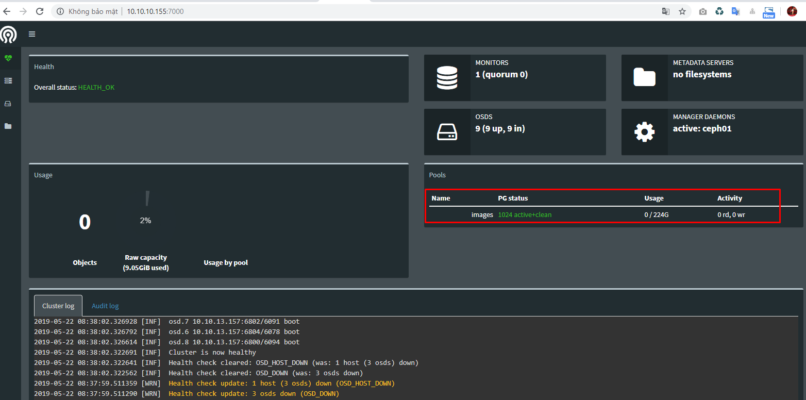

### Bước 2: Từ ceph server tạo 1 images (disk cho VM)

```
rbd create {pool-name}/{images} --size {size}
```

```
rbd create images/vol2 --size 15G
```

```
rbd info {pool-name}/{images}
```

```
rbd info images/vol2
```


### Bước 3: Cài đặt CEPH client trên client linux

- Trên client cài đặt ceph client

```
yum install ceph-common -y 
```

- Trên client download ceph.conf và key về /etc/ceph/

```
scp root@10.10.10.155:/etc/ceph/ceph.conf /etc/ceph/
scp root@10.10.10.155:/etc/ceph/{key-name}.keyring /etc/ceph/
```

```
scp root@10.10.10.155:/etc/ceph/ceph.conf /etc/ceph/
scp root@10.10.10.155:/etc/ceph/ceph.client.admin.keyring /etc/ceph/
```

{key-name}: Check ở ceph server

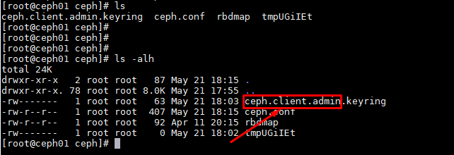

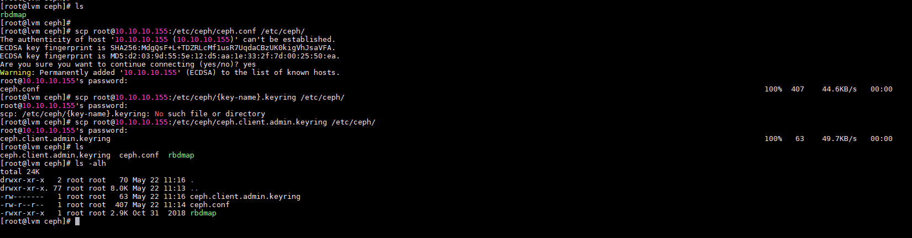

- Add config vào rbdmap trên ceph client

```
echo "{pool-name}/{images}            id=admin,keyring=/etc/ceph/ceph.client.admin.keyring" >> /etc/ceph/rbdmap
```

```
echo "images/vol2           id=admin,keyring=/etc/ceph/ceph.client.admin.keyring" >> /etc/ceph/rbdmap
```


- Kiểm tra 

```
sudo modprobe rbd
rbd feature disable {pool-name}/{images}  exclusive-lock object-map fast-diff deep-flatten
systemctl start rbdmap && systemctl enable rbdmap
```

```
sudo modprobe rbd
rbd feature disable images/vol2  exclusive-lock object-map fast-diff deep-flatten
systemctl start rbdmap && systemctl enable rbdmap
```


- Trên client xuất hiện phân cùng `rbd0` phân phối tự ceph server xuống có dung lượng 15 GB.

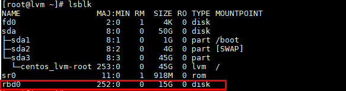

### Bước 3: Mount phân vùng mới theo

- Kiểm tra các phân vùng đang được gắn trên VM

```
fdisk -l
```

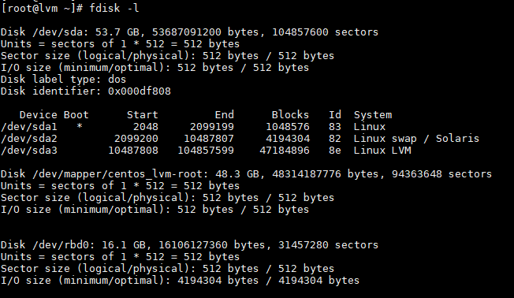


```
fdisk /dev/rbd0
```

```
m : xem hướng dẫn
		n : new partition
		p : primary
		default Partition number
		default First sector
		w :  Ghi lại thay đổi vào đĩa.
```

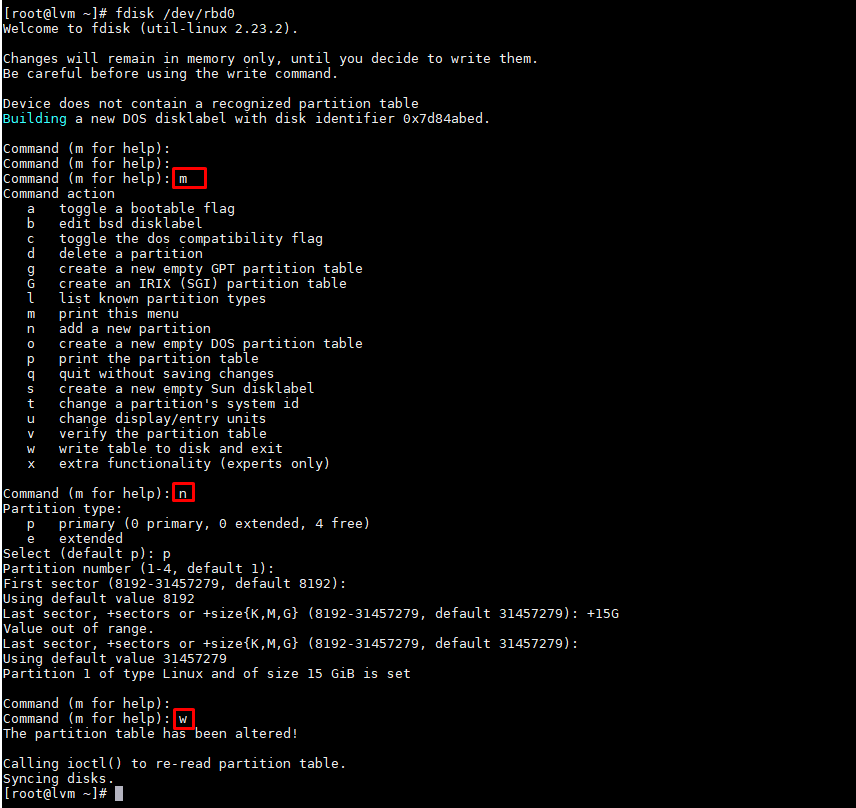

- Kiểm tra lại bằng `fdisk -l`

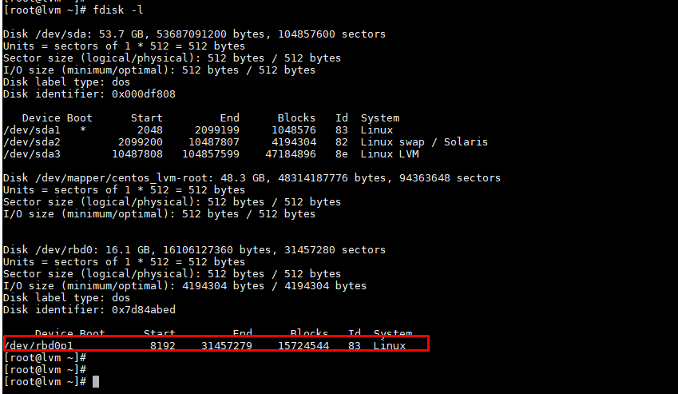

```
mkfs.ext4 /dev/rbd0p1
mkdir /data
mount /dev/rbd0p1 /data/
```

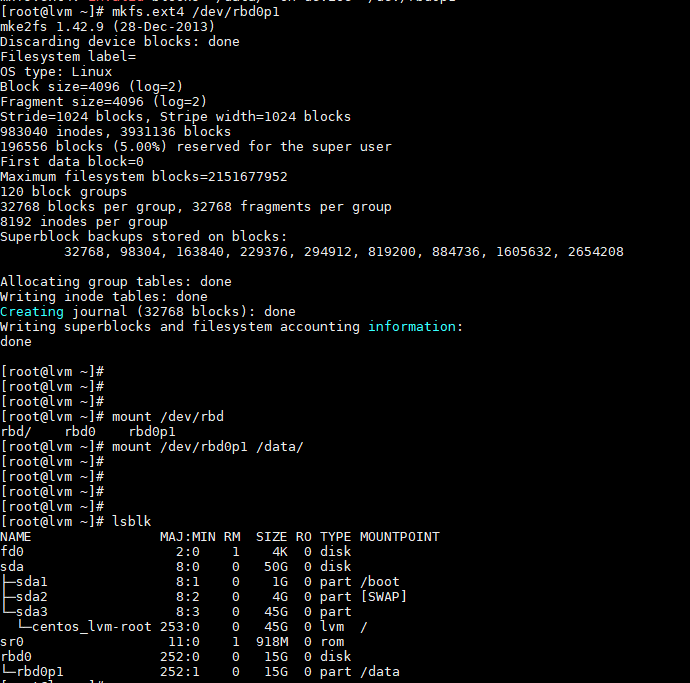

- Sửa trong fstab

Check id `blkid` để lấy ID.

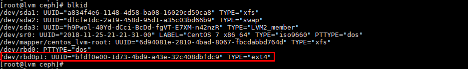

```
echo "UUID=bfdf0e00-1d73-4bd9-a43e-32c408dbfdc9 /data ext4 noauto 0 0" >> /etc/fstab
```

**Lưu ý**: Để tạo được thư mục theo kiểu LVM  phải chỉnh sửa filter
```
vi /etc/lvm/lvm.conf
```
`
+ Thêm dòng config sau vào đoạn dòng `142`

```
types = [ "rbd", 1024 ]
filter = [ "r|/dev/sdb1|", "r|/dev/disk/|", "r|/dev/block/|", "a/.*/" ]
```

+ Thực hiện các lệnh tạo LVM

<a name="extend"></a>
## 4. Extend volume

- Thực hiện trên node CEPH

```
rbd resize --size 2048 {pool-name}/{images} (to increase)
rbd resize --size 2048 {pool-name}/{images} --allow-shrink (to decrease)
```

```
rbd resize --size 30G images/vol11 --allow-shrink
```

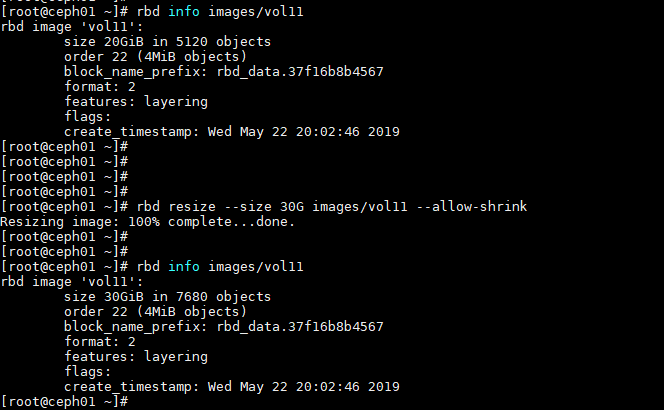

Như vậy ta đã resize `vol11` từ 20Gb lên 30Gb

- Kiểm tra trên client

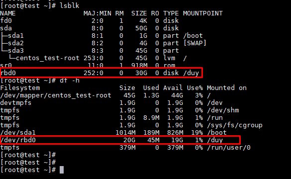

Phân vùng đã nhận đủ dung lượng khi tăng lên, nhưng dung lượng thực tế được sử dụng vẫn chưa đủ. Ta phải extend phía client lên.

Sử dụng công cụ `parted`

```
yum install parted -y
```

+ Hiển hị thông tin phần vùng.

```
parted /dev/rbd0 print free
```


+ Chạy lệnh sau để tăng kích thước phân vùng 1 tăng 10GB (tăng end trong partition table 20GB to 30GB).

```
parted /dev/rbd0 resizepart 1 30.0GB
```

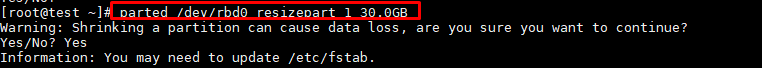

+ Sau khi chạy lệnh trên thì parted chỉ tăng ở partition table, chạy lệnh sau để resize:

```
resize2fs /dev/rbd0
```

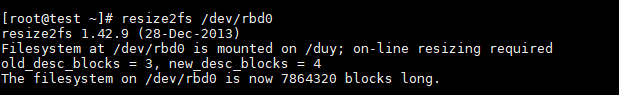

+ Kiểm tra lại.


