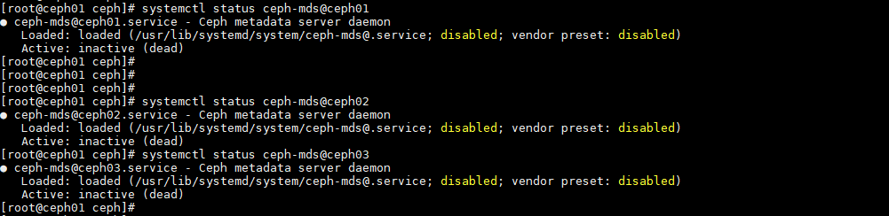
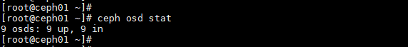
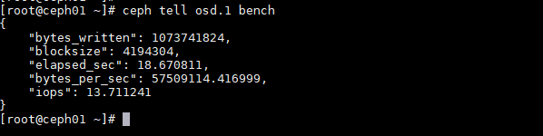
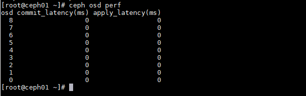

# Sử dụng các tập lệnh cơ bản trong CEPH

### Mục lục

[1. Lệnh ceph-deploy](#deploy)<br>
[2. Kiểm tra service ceph](#restart)<br>
[3. Kiểm tra trạng thái hệ thống](#trangthai)<br>
[4. Lệnh MGR service](#mgr)<br>
[5. Lệnh thao tác với OSD](#osd)<br>


<a name="deploy"></a>
## 1. Lệnh ceph-deploy

<a name="restart"></a>
## 2. Kiểm tra Service Ceph

**MON**

- Tiến Trình Giám Sát ( Ceph Monitor – Ceph MON)

Thành phần tập trung vào trạng thái toàn cluster, giám sát trạng thái OSD, MON, PG, CRUSH map. Các cluster nodes sẽ giám sát, chia sẻ thông tin về nhưng thay đổi. Quá trình giám sát sẽ không lưu trữ dữ liệu (công việc này là của OSD).

```
systemctl start ceph-mon@$(hostname)
systemctl stop ceph-mon@$(hostname)
systemctl restart ceph-mon@$(hostname)
```

```
systemctl restart ceph-mon@ceph01
```


**OSD**

- Đa phần Ceph Cluster được thực hiện bởi tiến trình Ceph OSD. Ceph OSD lưu tất cả dữ liệu người dùng dạng đối tượng. Ceph cluster bao gồm nhiều OSD. CEPH có cơ chế phân phối object vào các OSD khác nhau đảm bảo tính toàn vẹn và sẵn sàng của dữ liệu.

- OSD trên node nào thì đứng trên node đó để kiểm tra trạng thái của OSD đó.

+ Xác định ID của OSD

```
ceph osd tree
```


```
systemctl stop ceph-osd@{osd-id}
systemctl start ceph-osd@{osd-id}
systemctl restart ceph-osd@{osd-id}
```

```
systemctl restart ceph-osd@5
```


**MDS**

- Ceph MDS tập trung vào Metadata Server và yêu cầu riêng cho CephFS, và một số storage methods block; object-based storage không yêu cầu MDS services. 

```
systemctl restart ceph-mds@$(hostname)
```

```
systemctl status ceph-mds@ceph02
```



**RGW**

- Ceph phân phối object storage system, cung cấp object storage interface thông qua Ceph's object gateway, được biệt là RADOS gateway (radosgw).

```
systemctl status ceph-radosgw@rgw.$(hostname).service
```

```
systemctl status ceph-radosgw@rgw.ceph01.service
```


**MGR***

MGR chạy song song monitor daemons với để cung cấp giám sát và giao diện bổ sung cho hệ thống giám sát và quản lý từ bên ngoài.

```
systemctl start ceph-mgr@$(hostname)
systemctl restart ceph-mgr@$(hostname)
systemctl status ceph-mgr@$(hostname)
```


```
systemctl status ceph-mgr@ceph01
```

<a name="trangthai"></a>
## 3. Kiểm tra trạng thái hệ thống

- Hiển thị trạng thái cụm Ceph

```
ceph -s
```

```
ceph health
```

- Hiển thị chi tiết trạng thái cụm Ceph

```
ceph -s
```

- Hiển thị trạng thái cụm Ceph theo giời gian thực

```
ceph -w
```

- Kiểm tra trạng thái sử dụng disk của mỗi pool

```
ceph df
```

- Kiểm tra trạng thái sử dụng disk của mỗi pool theo Object

```
rados df
```


<a name="mgr"></a>
## 4. Lệnh MGR service

- Kiểm tra thông tin các module của MGR

```
ceph mgr dump
```

Hiển thị tất cả các module mà hệ thống CEPH hỗ trợ cho việc giám sát, quản lý từ bên ngoài, như zabbix, influx, prometheus...


- Enable các module MGR

```
ceph mgr module enable {module}
```

```
ceph mgr module enable zabbix
```


<a name="osd"></a>
## 5. Lệnh thao tác với OSD

- Kiểm tra OSD đươc tạo từ phân vùng ổ LVM nào trên server vật lý.

```
ceph-volume lvm list
```

OSD nào thì kiểm tra trên node đó.


- Hiển trị trạn thái các OSD trong cụm.

```
ceph osd stat
```



- Hiển thị tình trạng used, r/w, state của các osd


- Hiển thị Crushmap OSD

```
ceph osd tree
ceph osd crush tree
ceph osd crush tree --show-shadow
```


- Kiểm tra chi tiết location của 1 OSD

```
ceph osd find {osd-id}
```

```
ceph osd find 1
```


- Kiểm tra chi tiết metadata của 1 OSD

```
ceph osd metadata {osd-id}
```

```
ceph osd metadata 1
````


- Benchmark OSD

```
ceph tell osd.{osd-id} bench
```

```
ceph tell osd.1 bench
```



- Hiển thị trạng thái sử dụng của các OSD

```
ceph osd df 
ceph osd df tree
```


- Hiển thị latency Aplly, Commit data trên các OSD

```
ceph osd perf
```



- Xóa 1 osd ra khỏi cụm Ceph (Thực hiện trên node của OSD đó)

```
i={osd-id}
ceph osd out osd.$i
ceph osd down osd.$i
systemctl stop ceph-osd@$i
ceph osd crush rm osd.$i
ceph osd rm osd.$i
ceph auth del osd.$i
```

```
ceph osd out osd.1
ceph osd down osd.1
systemctl stop ceph-osd@1
ceph osd crush rm osd.1
ceph osd rm osd.1
ceph auth del osd.1
```


- Add 1 OSD vừa được remove ra khỏi cluster CEPH.

