# Ghi chép lại các bước cài đặt CEPH phiên bản luminous user

### Mục lục

[1. Mô hình triển khai](#mohinh)<br>
[2. IP Planning](#planning)<br>
[3. Thiết lập ban đầu](#thietlap)<br>
[4. Cài đặt](#caidat)<br>
[5. Khởi tạo MGR](#mgr)<br>
[6. Khởi tạo OSD](#osd)<br>

<a name="mohinh"></a>
## 1. Mô hình triển khai

Mô hình triển khai gồm 3 node CEPH mỗi node có 3 OSDs.

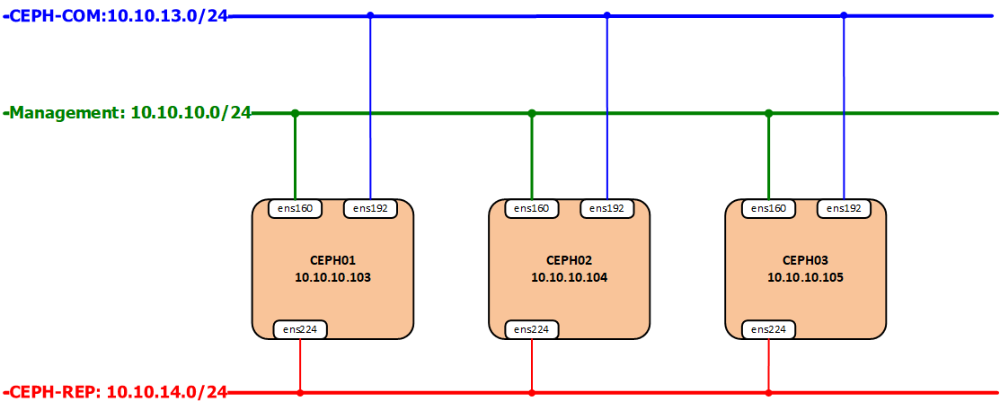

**OS** : CentOS7 - 64 bit<br>
**Disk**: 04 HDD, trong đó 01sử dụng để cài OS, 03 sử dụng làm OSD (nơi chứa dữ liệu của client) <br>
**NICs**:
	ens160: dùng để ssh và tải gói cài đặt
	ens192: dùng để các trao đổi thông tin giữa các node Ceph, cũng là đường Client kết nối vào
	ens224: dùng để đồng bộ dữ liệu giữa các OSD<br>
**Phiên bản cài đặt**: Ceph luminous

<a name="planning"></a>
## 2. IP Planning

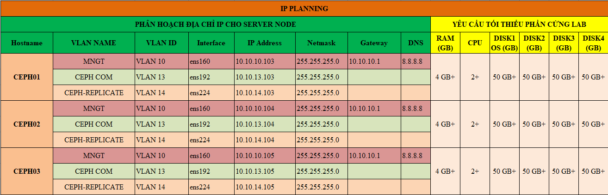

<a name="thietlap"></a>
## 3. Thiết lập ban đầu

**Update**

```
yum install epel-release -y
yum update -y
```

**Cấu hình IP**

Thực hiện trên 3 node với IP đã được quy hoạch cho các node ở mục 2.

```
nmcli c modify ens160 ipv4.addresses 10.10.10.103/24
nmcli c modify ens160 ipv4.gateway 10.10.10.1
nmcli c modify ens160 ipv4.dns 8.8.8.8
nmcli c modify ens160 ipv4.method manual
nmcli con mod ens160 connection.autoconnect yes

nmcli c modify ens192 ipv4.addresses 10.10.13.103/24
nmcli c modify ens192 ipv4.method manual
nmcli con mod ens192 connection.autoconnect yes

nmcli c modify ens224 ipv4.addresses 10.10.14.103/24
nmcli c modify ens224 ipv4.method manual
nmcli con mod ens224 connection.autoconnect yes

sudo systemctl disable firewalld
sudo systemctl stop firewalld
sudo systemctl disable NetworkManager
sudo systemctl stop NetworkManager
sudo systemctl enable network
sudo systemctl start network
sed -i 's/SELINUX=enforcing/SELINUX=disabled/g' /etc/sysconfig/selinux
sed -i 's/SELINUX=enforcing/SELINUX=disabled/g' /etc/selinux/config
```

**Kiểm tra đủ disk trên các node CEPH**

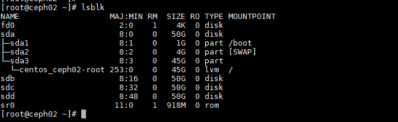

**Bổ sung file hosts**

Thực hiện trên 3 node CEPH.

```
cat << EOF >> /etc/hosts
10.10.13.103 ceph01
10.10.13.104 ceph02
10.10.13.105 ceph03
EOF
```

**Cài đặt NTPD**

```
yum install chrony -y 
```

```
systemctl start chronyd 
systemctl enable chronyd
systemctl restart chronyd 
```
 - Kiểm tra đồng bộ thời gian
 
```
chronyc sources -v
```

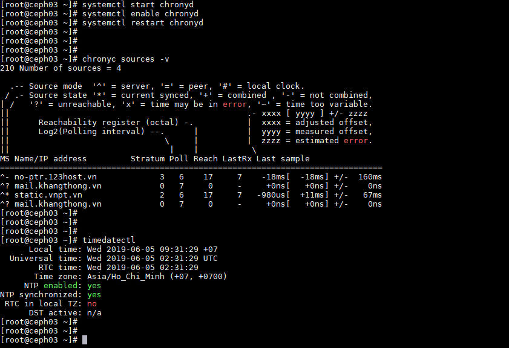

**Kiểm tra kết nối**

Thực hiện trên cả 3 node CEPH.

```
ping -c 10 ceph01
```

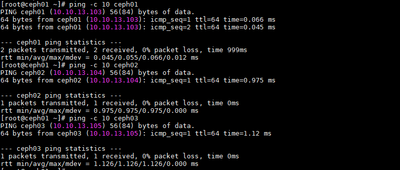

**Bổ sung user `cephuser`**

Thực hiện trên cả 3 node CEPH.

```
sudo useradd -d /home/cephuser -m cephuser
sudo passwd cephuser
```

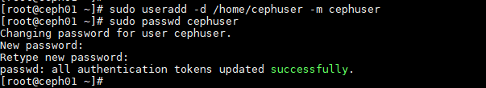

**Cấp quyền sudo cho `cephuser`**

Thực hiện trên cả 3 node CEPH.

```
echo "cephuser ALL = (root) NOPASSWD:ALL" | sudo tee /etc/sudoers.d/cephuser
sudo chmod 0440 /etc/sudoers.d/cephuser
```

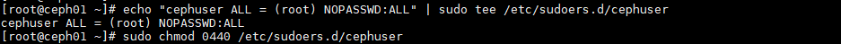

<a name="caidat"></a>
## 4. Cài đặt CEPH

Các bước ở dưới được thực hiện toàn toàn trên node `ceph01` và sử dụng `cephuser` để thao tác.

- Chuyển qua user `cephuser` để thao tác.

```
su cephuser
cd
```

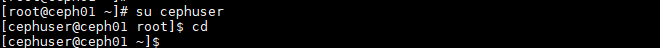

**Cài đặt ceph-deploy**

Thực hiện bằng user `root`

```
sudo yum install -y wget 
sudo wget https://download.ceph.com/rpm-luminous/el7/noarch/ceph-deploy-2.0.1-0.noarch.rpm --no-check-certificate
sudo rpm -ivh ceph-deploy-2.0.1-0.noarch.rpm
```

**Cài đặt `python-setuptools` để `ceph-deploy` có thể hoạt động ổn định.**

Thực hiện bằng user `root`

```
sudo curl https://bootstrap.pypa.io/ez_setup.py | python
```

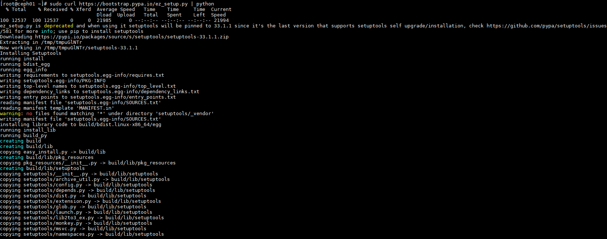

**Kiểm tra cài đặt**

```
ceph-deploy --version
```

Output : `2.0.1` là Ok.

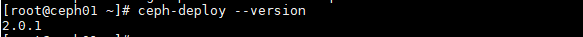

**Các bước ở dưới được thực hiện toàn toàn trên node ceph01 và sử dụng cephuser để thao tác**

```
su cephuser
cd 
```

**Tạo ssh key**

```
ssh-keygen
```

Enter khi có yêu cầu.

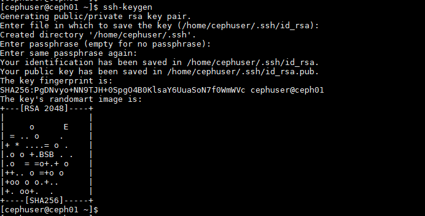

**Copy ssh key sang các node khác**

```
ssh-copy-id cephuser@ceph01
ssh-copy-id cephuser@ceph02
ssh-copy-id cephuser@ceph03
```

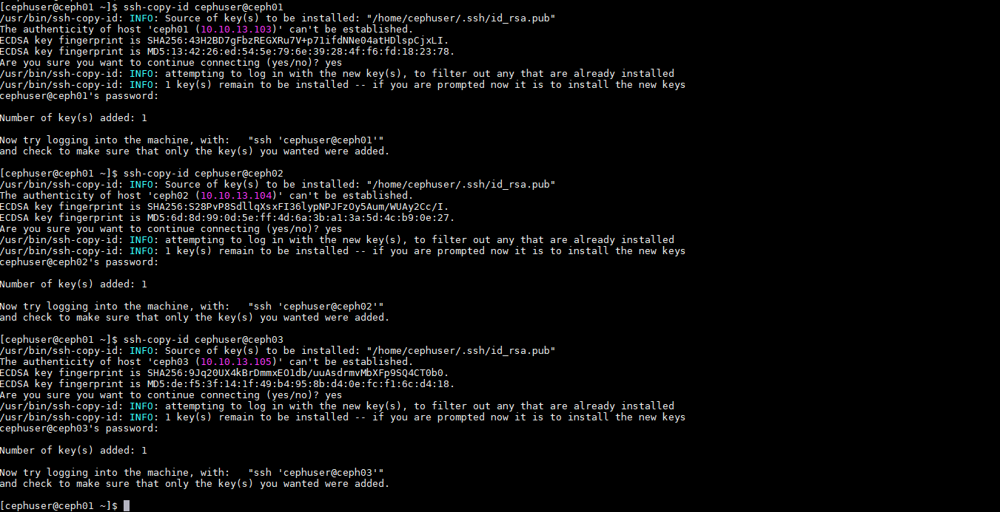

**Tạo các thư mục `ceph-deploy` để thao tác cài đặt vận hành cluster**

```
mkdir ceph-deploy && cd ceph-deploy
```

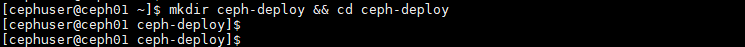

**Khởi tại file cấu hình cho cụm với node quản lý là `ceph01`**

```
ceph-deploy new ceph01
```

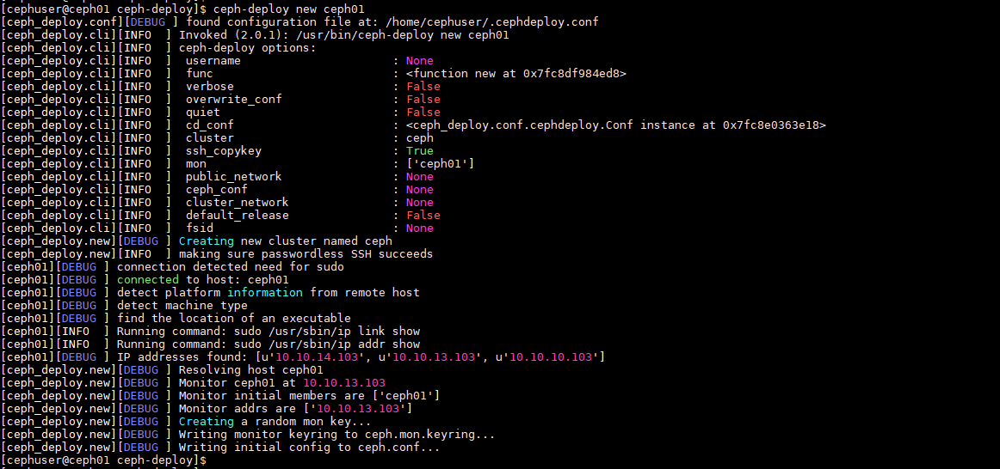

**Kiểm tra lại thông tin folder `ceph-deploy`**

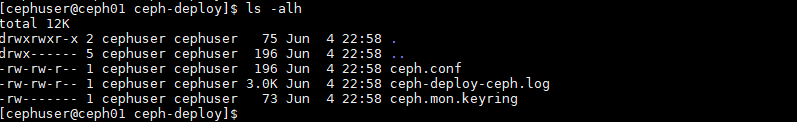

`ceph.conf` : file config được tự động khởi tạo

`ceph-deploy-ceph.log` : file log của toàn bộ thao tác đối với việc sử dụng lệnh ceph-deploy.

`ceph.mon.keyring` : Key monitoring được ceph sinh ra tự động để khởi tạo Cluster.

- Bổ sung thêm vào file `ceph.conf`

```
cat << EOF >> ceph.conf
osd pool default size = 2
osd pool default min size = 1
osd pool default pg num = 128
osd pool default pgp num = 128

osd crush chooseleaf type = 1

public network = 10.10.13.0/24
cluster network = 10.10.14.0/24
EOF
```

+ `public network` : Đường trao đổi thông tin giữa các node Ceph và cũng là đường client kết nối vào.

+ `cluster network` : Đường đồng bộ dữ liệu.

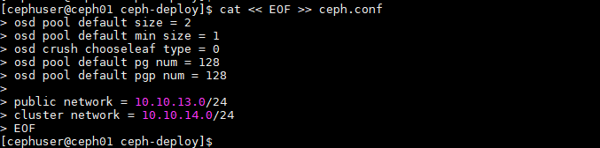

**Cài đặt ceph trên toàn bộ các node ceph**

**Lưu ý**: Nên sử dụng `byobu`, `tmux`, `screen` để cài đặt tránh hiện tượng mất kết nối khi đang cài đặt CEPH.

- Cài đặt ceph trên toàn bộ các node ceph

```
ceph-deploy install --release luminous ceph01 ceph02 ceph03
```

Đợi khoảng 30 phút để cài xong trên cả 2 node CEPH.

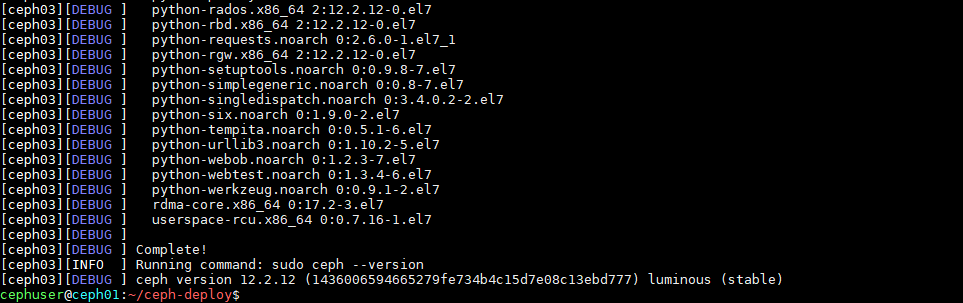

**Kiểm tra sau khi cài đặt**

```
ceph -v 
```

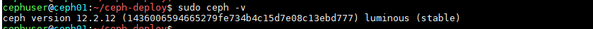

Đã cài đặt thành công CEPH trên node.

**Khởi tạo cluster với các node mon (Monitor-quản lý) dựa trên file ceph.conf**

```
ceph-deploy mon create-initial
```

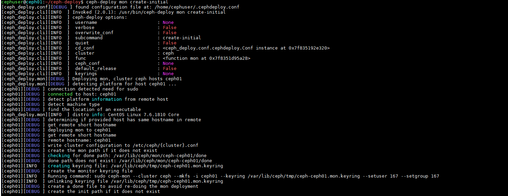

**Sau khi thực hiện lệnh phía trên sẽ sinh thêm ra 05 file : ceph.bootstrap-mds.keyring, ceph.bootstrap-mgr.keyring, ceph.bootstrap-osd.keyring, ceph.client.admin.keyring và ceph.bootstrap-rgw.keyring. Quan sát bằng lệnh ll -alh**

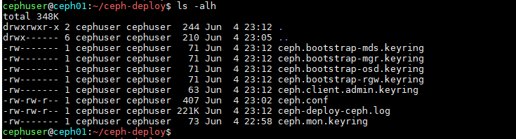

**Để node ceph01 có thể thao tác với cluster chúng ta cần gán cho node ceph01 với quyền admin bằng cách bổ sung cho node này admin.keying**

```
ceph-deploy admin ceph01
```

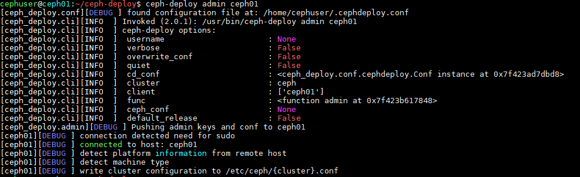

- Kiểm tra bằng lệnh `sudo ceph -s`

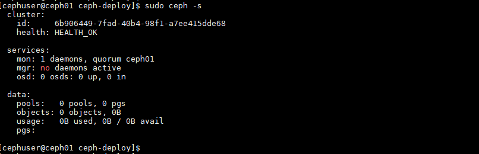

<a name="mgr"></a>
## 5. Khởi tạo MGR

Ceph-mgr là thành phần cài đặt cần khởi tạo từ bản lumious, có thể cài đặt trên nhiều node hoạt động theo cơ chế Active-Passive.

- Cài đặt ceph-mgr trên ceph01

```
ceph-deploy mgr create ceph01
```

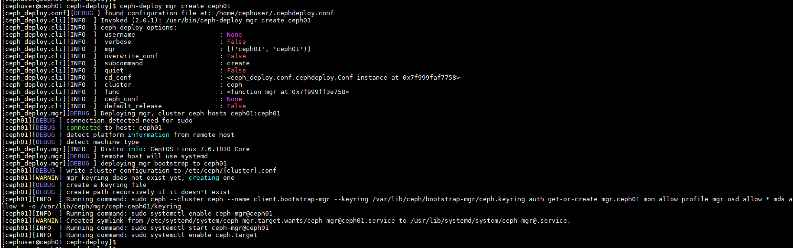

- Ceph-mgr hỗ trợ dashboard để quan sát trạng thái của cluster, Enable mgr dashboard trên host ceph01.

```
sudo ceph mgr module enable dashboard
sudo ceph mgr services
```


Truy cập vào mgr dashboard với username và password vừa đặt ở phía trên để kiểm tra.

```
https://<ip-ceph01>:7000
```

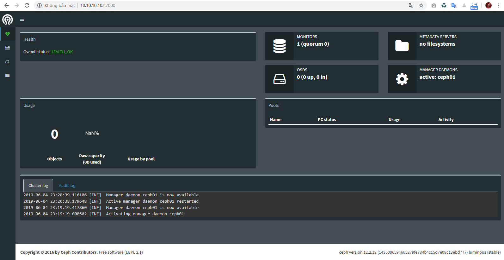

## 6. Khởi tạo OSD

### Tạo OSD thông qua ceph-deploy tại host ceph01

- Trên ceph01, dùng `ceph-deploy` để partition ổ cứng OSD, thay ceph01 bằng hostname của host chứa OSD.

```
ceph-deploy disk zap ceph01 /dev/sdb
```

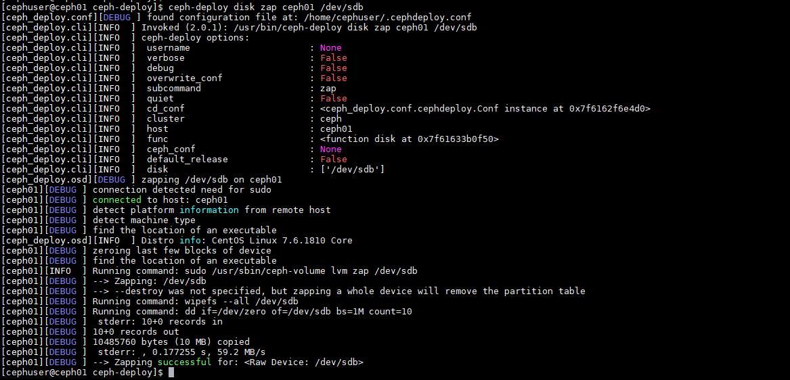

```
ceph-deploy osd create --data /dev/sdb ceph01
```

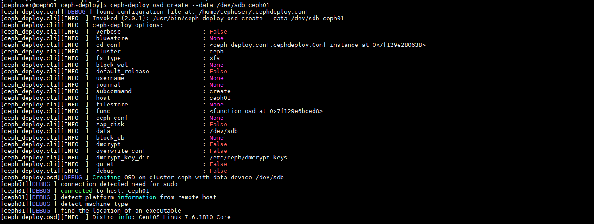

- Kiểm tra osd vừa tạo bằng lệnh

```
sudo ceph osd tree
```

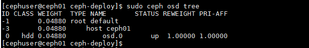

```
lsblk
```

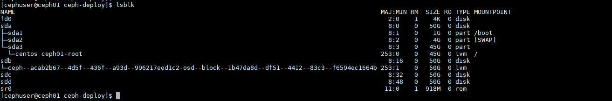

**Lưu ý**: Thực hiện tương tự cho các OSD còn lại ở node CEPH01 và CEPH02, CEPH03.

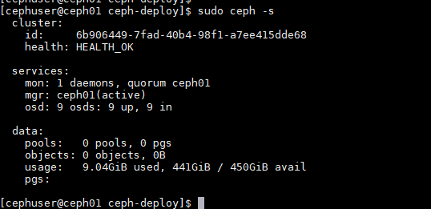

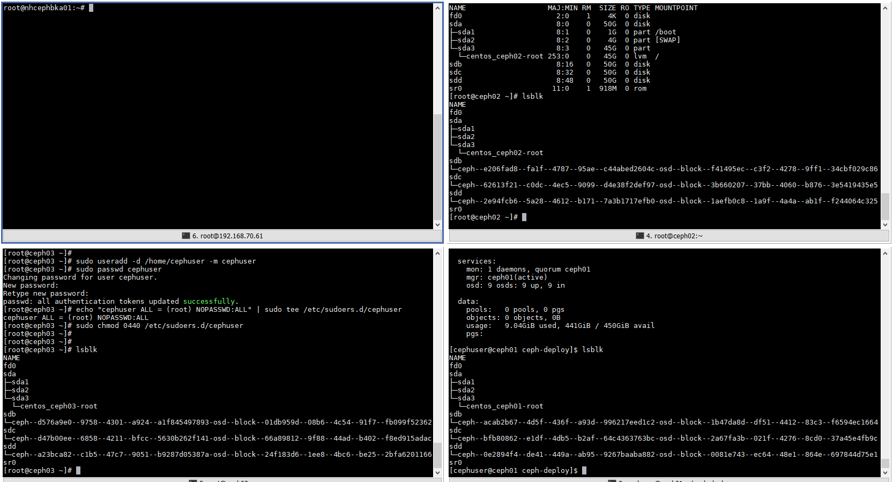

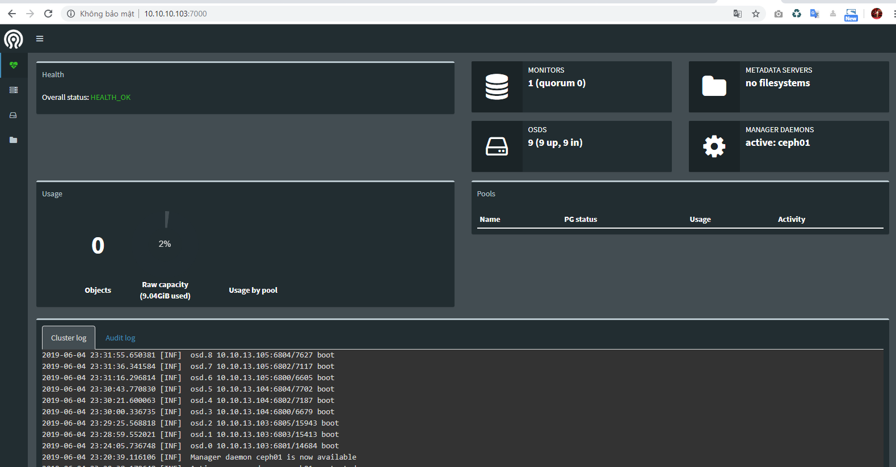

### Tham khảo

https://github.com/uncelvel/tutorial-ceph/blob/master/docs/setup/ceph-luminous-cephuser.md


