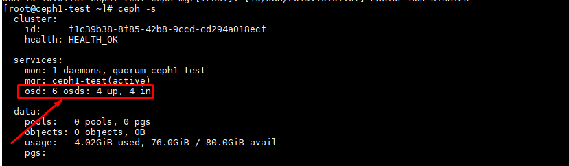
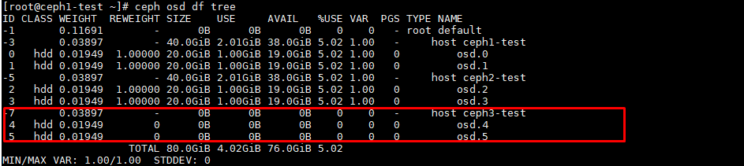
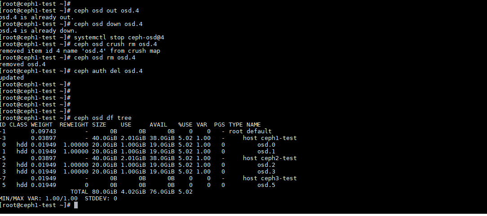
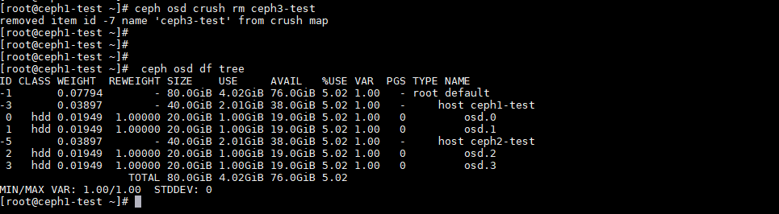

# Ghi lại một số bước để remove 1 node ra khỏi cụm CEPH Cluster, add một host vào ceph cluster

Áp dụng trong trường hợp một node server vật lý bị hỏng phần cứng không sử dụng được nữa, cần phải down xuống và thay thế bằng node CEPH khác.
Theo cơ chế replicate của CEPH trường hợp down 1 node data sẽ tự rebalance sang các node khác đảm bảo tính toàn vẹn của dữ liệu chỉ ảnh hưởng tới hiệu năng tại thời điểm rebalance data.


## 1. Remove một node
```
ceph -s
```



```
ceph osd df tree
```



- Shutdown node bị hỏng

- Đợi để quá trình rebalance data diên ra hoàn tất.

- Thực hiện out OSD 

```
i={osd-id}
ceph osd out osd.$i
ceph osd down osd.$i
systemctl stop ceph-osd@$i
ceph osd crush rm osd.$i
ceph osd rm osd.$i
ceph auth del osd.$i
```

```
ceph osd out osd.4
ceph osd down osd.4
systemctl stop ceph-osd@4
ceph osd crush rm osd.4
ceph osd rm osd.4
ceph auth del osd.4
```



Thực hiện với các osd còn lại của host.
- Remove node bucket ra khỏi cluster

```
cep osd crush rm {bucket-name}
```

```
cep osd crush rm ceph3-test
```



## 2. Add một node mới vào cluster


- Chuẩn bị hạ tầng thông nhau, đặt IP, hostname chuẩn.

### Thao tác trên node CEPH mới.

Tạo user `cephuser`
```sh 
useradd cephuser
passwd cephuser 
```

Bổ sung quyền cho `cephuser`
```sh 
echo "cephuser ALL = (root) NOPASSWD:ALL" | sudo tee /etc/sudoers.d/cephuser
sudo chmod 0440 /etc/sudoers.d/cephuser
```


# Thao tác trên Node Ceph Deploy

Node CEPH mới 10.10.10.103

Bổ sung /etc/hosts thông tin IP của node CEPH mới.
```sh 
echo "10.10.13.103 ceph04" >> /etc/hosts
```

Chuyển qua User ceph-deploy 
```sh 
su cephuser 
```

Copy ssh-key
```sh 
ssh-copy-id cephuser@ceph04
```

Truy cập vào folder `ceph-deploy`
```sh 
cd 
cd ceph-deploy
```


```
ceph-deploy install --release luminous ceph04
```

Copy key và config qua cho node CephSSD07
```sh 
ceph-deploy admin ceph04
```

# QUay lại node Ceph mới
Kiểm tra key và kết nối đến cụm 
```sh 
ceph -s 
```


# Quay lại node Ceph deploy
- Tạo host `ceph04`

```
sudo ceph osd crush add-bucket ceph04 host
```

- Di chuyển host `ceph04` vào `root default`
```
sudo ceph osd crush move ceph04 root=default
```

- Create OSD 
```
ceph-deploy disk zap ceph04 /dev/sdb
ceph-deploy osd create --data /dev/sdb ceph04
sudo ceph osd crush move osd.49 host=ceph04
```

Làm hết với các OSD còn lại của node.

- Reweight OSD 

Nên cấu hình trong file config không tự động rebalance data khi join OSD mới.
```
osd crush update on start = false
```
Khi đó thực hiện join từng OSD mới một.

```sh 
sudo ceph osd reweight osd.{osd-id} {weight1} 
sudo ceph osd crush reweight osd.{osd-id} {weight2}
```
- {weight1}: Recommend là % sử dụng của cụm tương ứng với %use mà chúng ta muốn đẩy vào ổ mới
- {weight2}: Là dung lượng thực tế của ổ tính theo TiB, Ceph sẽ dựa trên tham số này để định lượng data đẩy vào OSD sau này


```sh 
sudo ceph osd reweight osd.5 0.7 
sudo ceph osd crush reweight osd.5 0.87329
```

