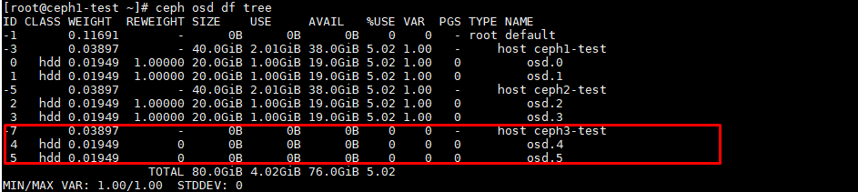

# Ghi lại một số bước để remove 1 node ra khỏi cụm CEPH Cluster

Áp dụng trong trường hợp một node server vật lý bị hỏng phần cứng không sử dụng được nữa, cần phải down xuống và thay thế bằng node CEPH khác.
Theo cơ chế replicate của CEPH trường hợp down 1 node data sẽ tự rebalance sang các node khác đảm bảo tính toàn vẹn của dữ liệu chỉ ảnh hưởng tới hiệu năng tại thời điểm rebalance data.


## Remove một node
```
ceph -s
```


```
ceph osd df tree
```



- Shutdown node bị hỏng

- Đợi để quá trình rebalance data diên ra hoàn tất.

- Thực hiện out OSD 

```
i={osd-id}
ceph osd out osd.$i
ceph osd down osd.$i
systemctl stop ceph-osd@$i
ceph osd crush rm osd.$i
ceph osd rm osd.$i
ceph auth del osd.$i
```

```
ceph osd out osd.4
ceph osd down osd.4
systemctl stop ceph-osd@4
ceph osd crush rm osd.4
ceph osd rm osd.4
ceph auth del osd.4
```


Thực hiện với các osd còn lại của host.
- Remove node bucket ra khỏi cluster

```
cep osd crush rm {bucket-name}
```

```
cep osd crush rm ceph3-test
```


## Add một node mới vào cluster


- Chuẩn bị hạ tầng thông nhau, đặt IP, hostname chuẩn.


