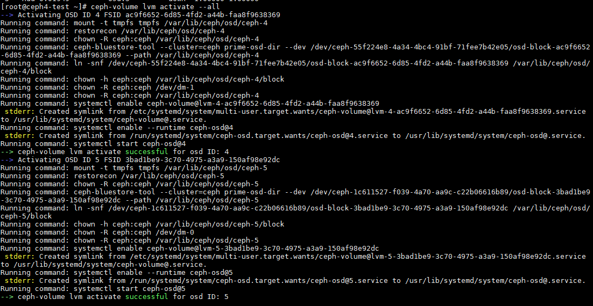
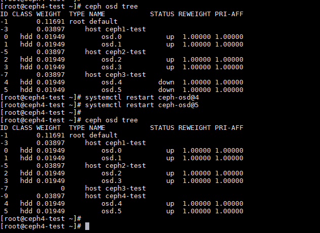

# Hướng dẫn chuyển OSD của một node trong ceph cluster bị lỗi sang một node mới thay thế.

### Bước 1: Chuẩn bị

Khuyến cáo nên chuẩn bị:

+ Server cùng dòng, card raid cùng dòng với node cũ.

+ OS cùng version với node cũ.

+ Cài đặt hostname, IP, cấu hình giống node cũ.

+ Chuyển các OSD của node cũ sang và 

### Bước 2: Join node với cụm CEPH

- Đứng ở node mới

Tạo user `cephuser`

```
useradd cephuser
passwd cephuser 
```

Bổ sung quyền cho `cephuser`

```
echo "cephuser ALL = (root) NOPASSWD:ALL" | sudo tee /etc/sudoers.d/cephuser
sudo chmod 0440 /etc/sudoers.d/cephuser
```

- Đứng ở node ceph deploy

Chuyển qua User ceph-deploy 
```sh 
su cephuser 
```

Copy ssh-key
```sh 
ssh-copy-id cephuser@new_node
```

Cài đặt CEPH nên node mới

```
ceph-deploy install --release luminous new_node
```

Copy key và config qua cho node Ceph mới

```
ceph-deploy admin new_node
```

Check bằng câu lệnh `ceph -s` kết quả ok là đã join node mới thay thế vào ceph cluster.

Gắn các OSD từ node hỏng sang node mới và thực hiện

```
ceph-volume lvm activate --all
```



Restart lại service của từng OSD

```
systemctl restart ceph-osd@id
```

