# Ghi chép lại các bước add - remove node chạy service mon, mgr

Hệ thống sử dụng ceph-user để deploy và có 1 node mon

## 1. Add thêm một node mon mới

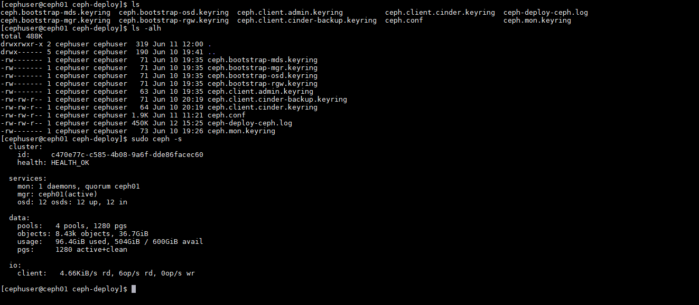

```
 services:
    mon: 1 daemons, quorum ceph01
    mgr: ceph01(active)
    osd: 12 osds: 12 up, 12 in
```

### Tạo thêm một node mon trên CEPH2

Đứng ở node CEPH deploy

- Chỉnh sửa `mon_host` trong file config và push config sang các node khác.

```
su cephuser
cd
cd ceph-deploy
```

```
vi ceph.conf
```

Chỉnh sửa config thêm cả IP node mon mới

```
mon_initial_members = ceph01, ceph02
mon_host = 10.10.13.155,10.10.13.156

```

```
ceph-deploy --overwrite-conf config push ceph01 ceph02 ceph03 ceph04
```

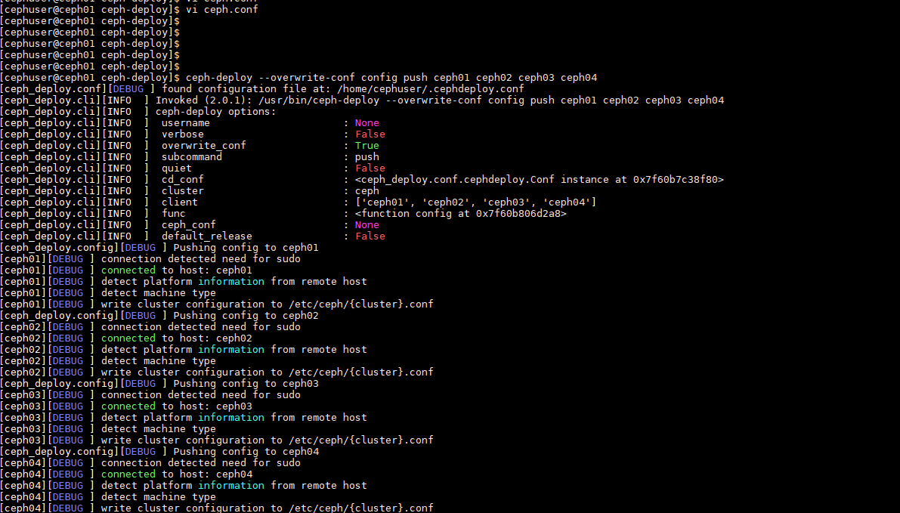


```
systemctl restart ceph-mon@ceph01
systemctl restart ceph-mgr@ceph01
```

- Tạo node mon mới

```
ceph-deploy mon create ceph02
```

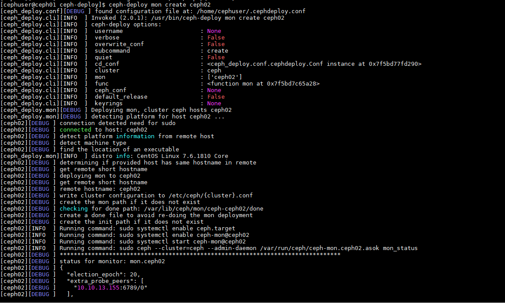

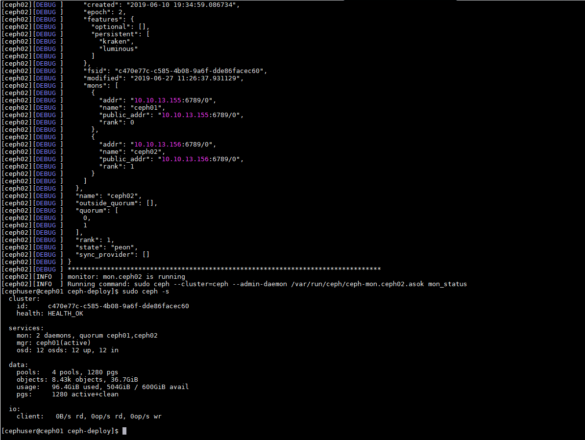

- Add node mon mới vào cluster.

```
ceph-deploy mon add ceph02
```

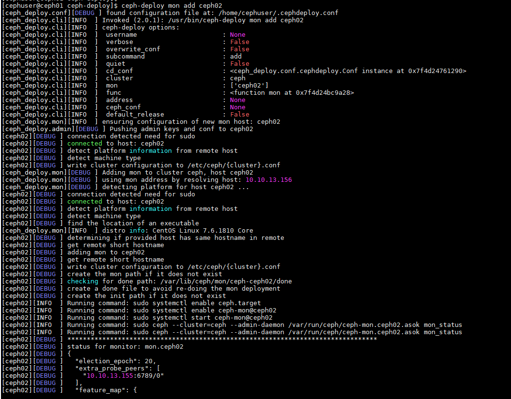

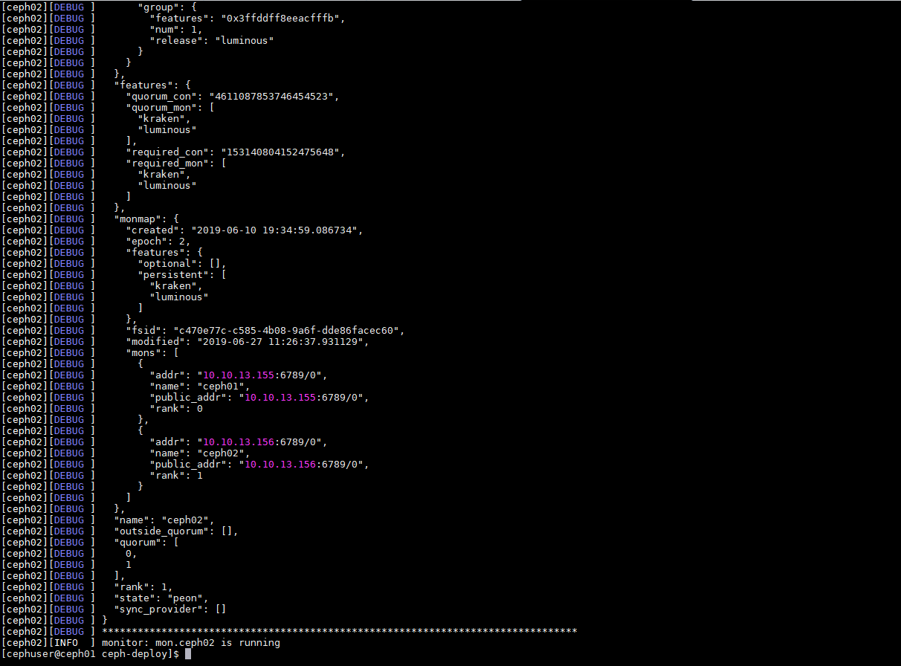

- Check 

Sang node ceph mon mới check service mon

```
systemctl status ceph-mon@ceph02
```

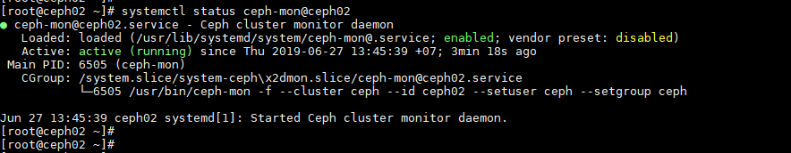


## 2. Remove 1 node mon

```
ceph-deploy mon destroy ceph04
```

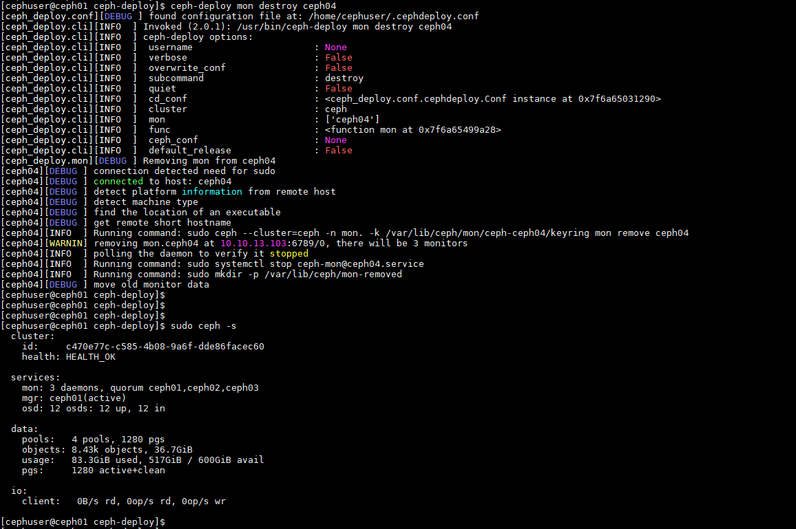


## 3. Add thêm một node chạy service mgr

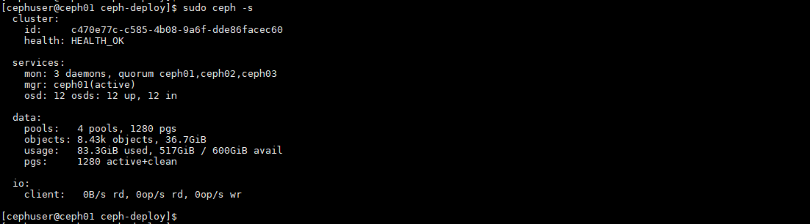

```
su cephuser
cd
cd ceph-deploy
```

```
ceph-deploy mgr create ceph02
```


- Check trên node mon mới

```
systemctl status ceph-mgr@ceph02
```

Lúc này đã có 2 node mon ở chế độ 1 - actives, 1 -standbys

- Stop service mon ở node 1 để test mon ở node 2

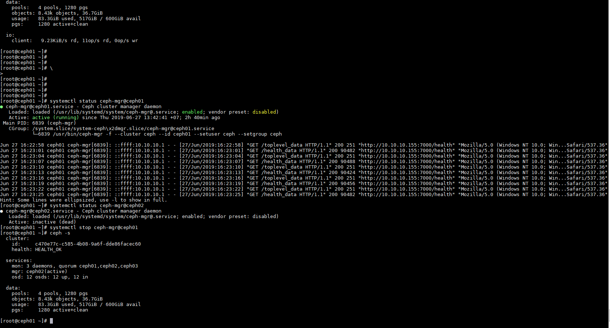


```
[root@ceph01 ~]# ceph -s
  cluster:
    id:     c470e77c-c585-4b08-9a6f-dde86facec60
    health: HEALTH_OK

  services:
    mon: 3 daemons, quorum ceph01,ceph02,ceph03
    mgr: ceph02(active)
    osd: 12 osds: 12 up, 12 in

  data:
    pools:   4 pools, 1280 pgs
    objects: 8.43k objects, 36.7GiB
    usage:   83.3GiB used, 517GiB / 600GiB avail
    pgs:     1280 active+clean

[root@ceph01 ~]#
```

Service mgr đã chạy ở node2

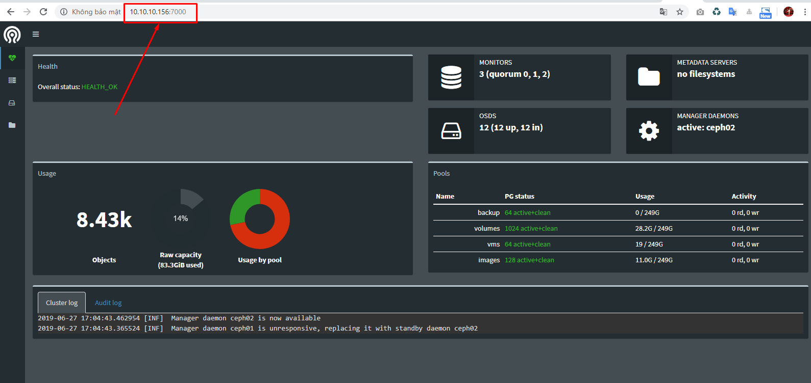

- Khi service mgr ở node 1 được start lên thì ceph01 vẫn chạy ở chế độ `standbys` và không chạy ở chế độ `active` cho đến khi node active hiện tại down thì mới lên.

