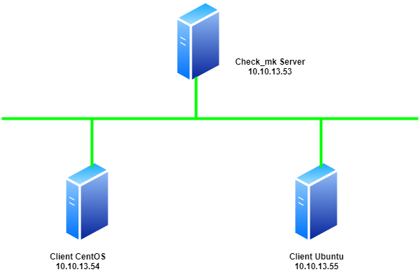
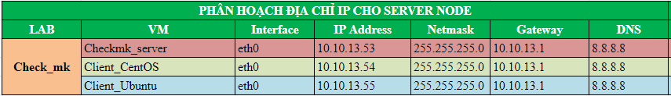
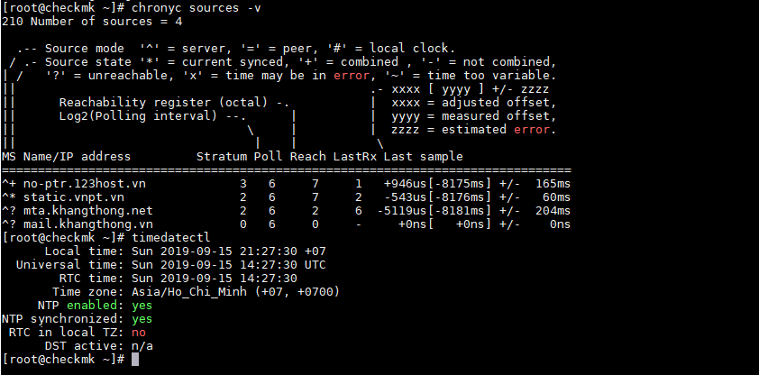
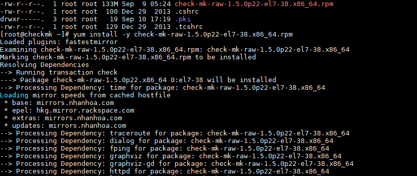
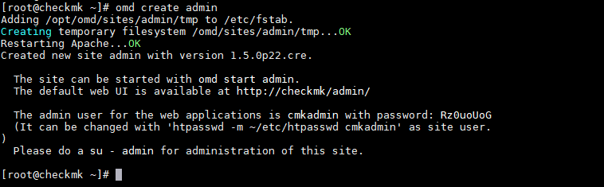
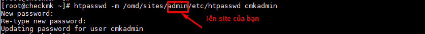
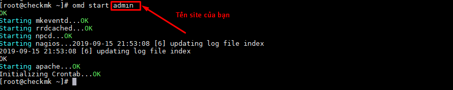
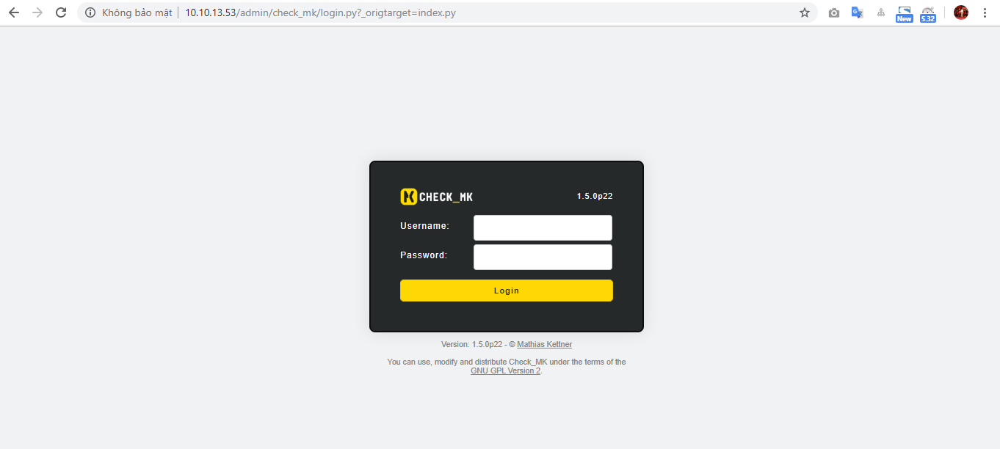
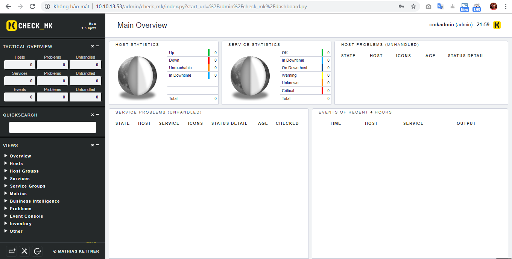

# Ghi chép lại các bước cài đặt check_mk version 1.5p22 trên CentOS7

### Mục lục


[1. Mô hình triển khai](#mohinh)<br>
[2. IP Planning](#planning)<br>
[3. Thiết lập ban đầu](#thietlap)<br>
[4. Cài đặt](#caidat)<br>

<a name="mohinh"></a>
## 1. Mô hình triển khai

Mô hình triển khai gồm 1 node Check_mk server và các node client.



<a name="planning"></a>
## 2. IP Planning



<a name="thietlap"></a>
## 3. Thiết lập ban đầu

**Update**

```
yum install epel-release wget -y
yum update -y
```

**Cấu hình IP**

Thực hiện trên các node với IP đã được quy hoạch cho các node ở mục 2.

```
nmcli c modify ens160 ipv4.addresses 10.10.13.53/24
nmcli c modify ens160 ipv4.gateway 10.10.13.1
nmcli c modify ens160 ipv4.dns 8.8.8.8
nmcli c modify ens160 ipv4.method manual
nmcli con mod ens160 connection.autoconnect yes


sudo systemctl disable firewalld
sudo systemctl stop firewalld
sudo systemctl disable NetworkManager
sudo systemctl stop NetworkManager
sudo systemctl enable network
sudo systemctl start network
sed -i 's/SELINUX=enforcing/SELINUX=disabled/g' /etc/sysconfig/selinux
sed -i 's/SELINUX=enforcing/SELINUX=disabled/g' /etc/selinux/config
```

**Cài đặt NTPD**

```
yum install chrony -y 
```

```
systemctl start chronyd 
systemctl enable chronyd
systemctl restart chronyd 
```
 - Kiểm tra đồng bộ thời gian
 
```
chronyc sources -v
```



<a name="caidat"></a>
## 4. Cài đặt Check_mk server

- Tải về file cài đặt: Lựa chọn version 1.5 bản chuẩn cuối p22

```
wget https://checkmk.com/support/1.5.0p22/check-mk-raw-1.5.0p22-el7-38.x86_64.rpm
```

- Cài đặt gói `rpm` vừa download

```
yum install -y check-mk-raw-1.5.0p22-el7-38.x86_64.rpm
```



- Tạo site với tên site tùy ý

```
omd create admin
```



Mặc định khi tạo site sẽ tạo ra pass ngẫu nhiên cho user `cmkadmin`

- Thực hiện change pass `cmkadmin`

```
htpasswd -m /omd/sites/admin/etc/htpasswd cmkadmin
```



- Khởi động site

```
omd start admin
```


- Truy cập

```
http://ip_server/site_name
```

```
http://10.10.13.53/admin
```
Truy cập bằng tài khoản cmkadmin và pass vừa đổi.






