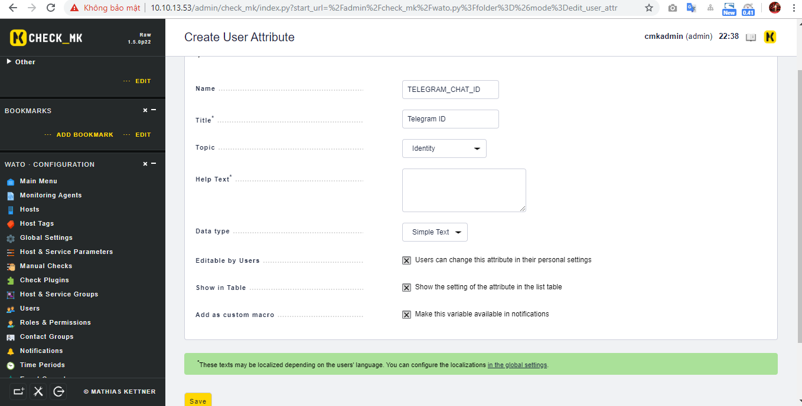
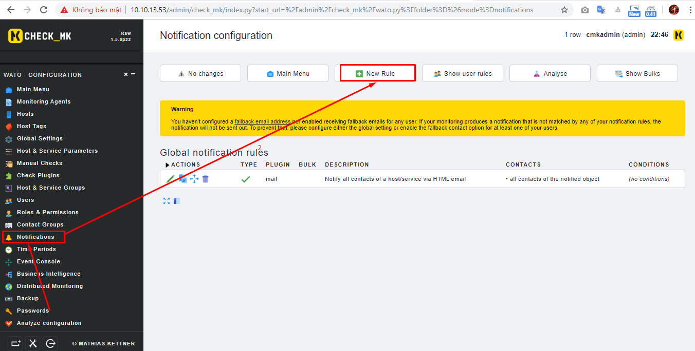

# Ghi chép lại các bước setup cảnh báo check_mk bởi telegram


### 1. Tạo bot telegram và tìm ID user

- Tạo bot telegram để hiển thị cảnh bảo gửi từ check_mk server về.

Truy cập đường link `https://telegram.me/botfather` để mở botfather


Thực hiện các bước sau

```
/newbot
```

Đặt tên cho bot 

```
duydm_test_all_bot
```

Xác nhận: Chú ý phải có hậu tố `_bot` ở sau tên thì mới tạo được botfather

```
duydm_test_all_bot
```

Bạn sẽ nhận được thông tin con bot telegram của mình, lưu giữ lại chuỗi token.


- Xác định ID user

Để người dùng bất kỳ nào có thể nhận được cảnh báo thì user phải chat vào con bot đó và từ đó ta sẽ lấy được ID của người dùng đó để thiết lập cảnh báo trên check_mk. 

**Lưu ý**: Sau chỗ `.org/` phải có chữ `bot` xong mới tới `tokencuaban`.

```
https://api.telegram.org/bottokencuaban/getUpdates
```


### 2. Cấu hình trên check_mk server

**2.1.Tạo ra file telegram.py**

Tạo file với nội dung ở dưới

```
vi /omd/sites/admin/share/check_mk/notifications/telegram.py
```

Lưu ý: Trên đường dẫn tạo file ở trên `admin` chính là site của bạn.

Thay thế `token_cua_ban` bằng token con bot hiên thị cảnh báo. Bạn truy cập vào đường link ở dưới để lấy đoạn script cảnh báo qua telegram.

```
https://paste.cloud365.vn/?d81c54e86a5a20c1#yJw1TCDmVPZMtdu2DvG00BO15tGHiJjR4EO8QpGuAO4=
```

- Change quyền

```
chmod +x /omd/sites/admin/share/check_mk/notifications/telegram.py
```

- Restart lại omd server

```
omd restart
```

**2.2. Cấu hình trên WATO giao diện web check_mk server**


- Tạo `Attributes User`

Click `Users` -> `Custom attributes`


Click `Attribute`


Nhập các thông tin chính xác sau:

```
Name: TELEGRAM_CHAT_ID
Title: Telegram ID
Topic: Lựa chọn Identity
Tích chọn: Users can change this attribute in their personal settings, Show the setting of the attribute in the list table, Make this variable available in notifications
```



- Tạo user muốn nhận cảnh báo

Click `User` -> `New user`


Nhập thông tin user mới lưu ý nhập chính xác `ID telegram` của user.


- Tạo rule cảnh báo

Click `Notification` -> `New Rule`



Ta có thể tùy chỉnh rất mạnh ở đây ví dụ như gửi cảnh báo tới ai, tới nhóm nào, xảy ra bởi sự kiện nào...


Lưu ý: `Notification Method` lựa chọn `Gui Canh Bao Telegram`

Xác nhận thay đổi sau mỗi lần thay đổi cấu hình 


- Gửi test cảnh báo


Như vậy đã thiết lập cảnh báo check_mk qua telegram thành công.


