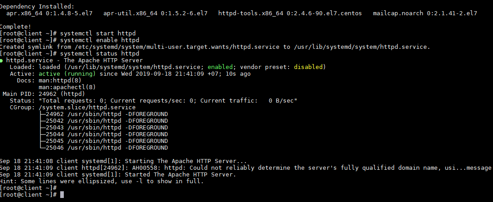
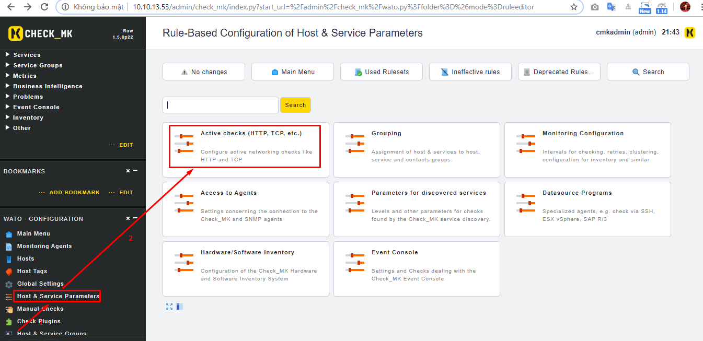
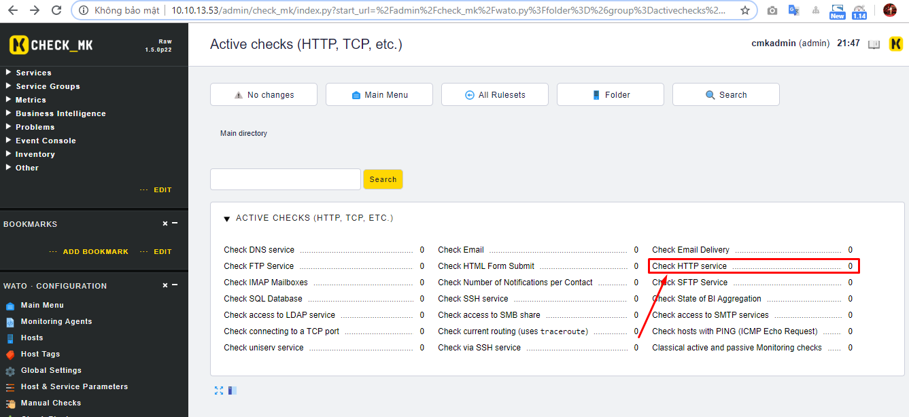
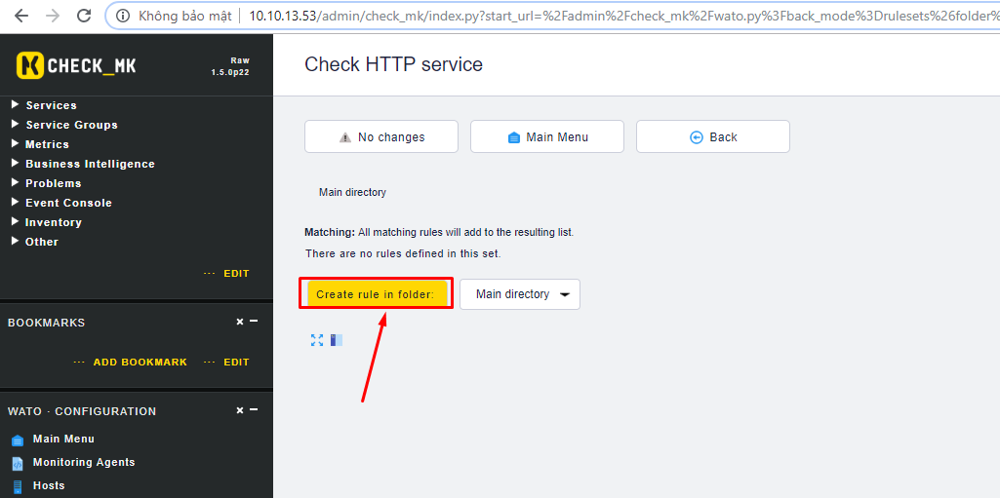
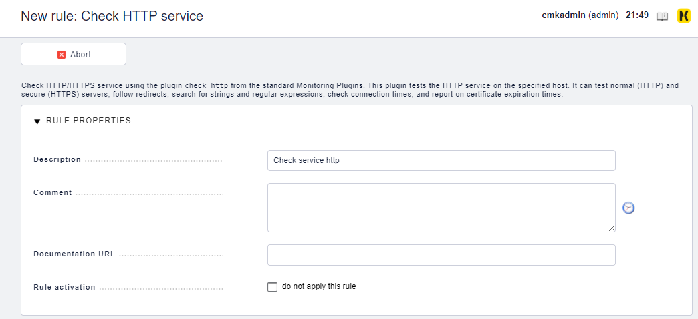
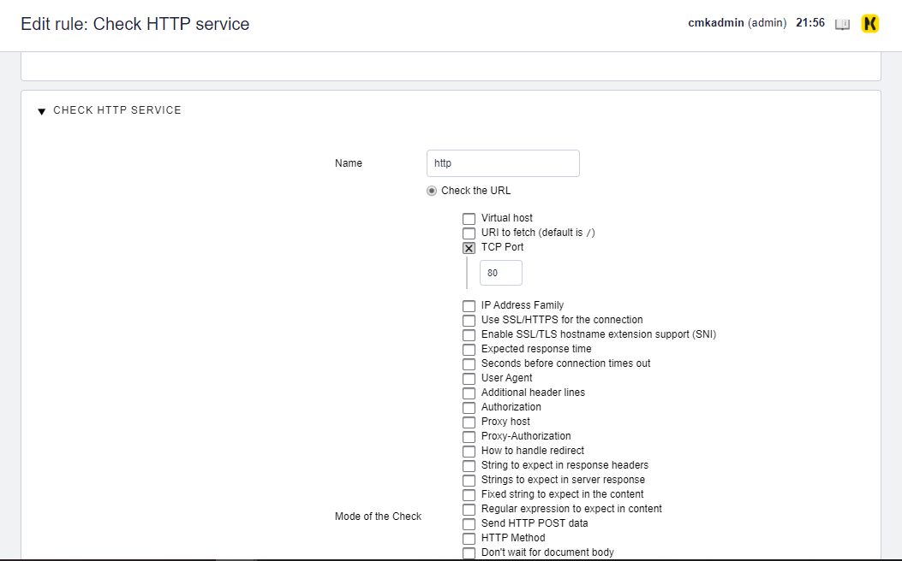
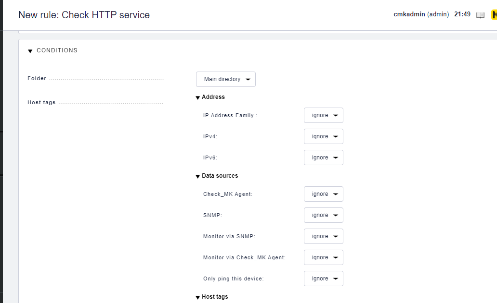
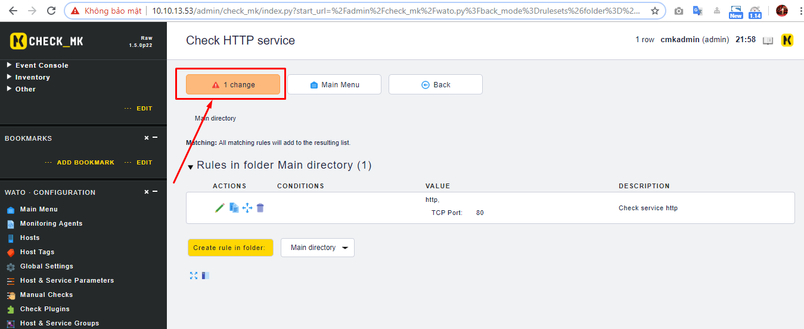
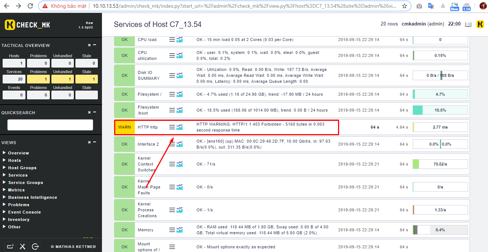

# Ghi chép lại các bước setup monitor service http

## 1. Chuẩn bị

- Check_mk server

- Client có cài service http

```
yum -y install httpd 
```



##. 2 Monitor server http

- Sử dụng kiểu `Active check` check_mk đã hỗ trợ sẵn.

Click `Host & Service Parameters` -> `Active checks (HTTP, TCP, etc.)`



Click `Check HTTP service`



- Tạo vào tùy biến `rule` cho việc check service http



`RULE PROPERTIES`: Mô tả cơ bản cho rules



`CHECK HTTP SERVICE`: Tùy vào check_mk hỗ trợ check những gì trong http service để lựa chọn. Có rất nhiều lựa chọn để monitor sâu về service http. Ở đây tôi thực hiện check xem port 80 có mở hay không.



`CONDITIONS`: Là những điều kiện áp rule cho host nào, IP nào ...



Lưu ý: Active những thay đổi vừa cấu hình.



Như vậy đã monitor được service http.



