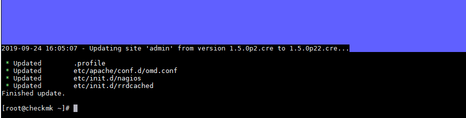

# Ghi chép các bước để update vesion check_mk

**Ngữ cảnh sử dụng**: Check_mk liên tục cung cấp tính năng mới trong các bản phát hành, việc cập nhật lên phiên bản mới giúp ta cập nhất các tính năng mới để monitor cho hệ thống của mình.

## 1. Update phiên bản khách nhau trong môt version

Ở đây ta có một check_mk server phiên bản `1.5.0p2 (CRE)` và muốn update lên `1.5.0p22 (CRE)` ta thực hiện như sau.


```
omd versions
```


- Tải bản cài đặt mới tại đây!

```
https://checkmk.com/download-archive.php
```


- Cài đặt phiên bản mới bằng gói cài `.rpm` vừa tải về.


```
yum install -y check-mk-raw-1.5.0p22-el7-38.x86_64.rpm
```


- Kiểm tra lại phiên bản

```
omd versions
```


- Kiểm tra phiên bản check_mk đang chạy cho site của bạn tạo. Site của bạn tên là gì bạn check là vậy, site của mình tên là `admin`.

```
omd version admin
```


- Lúc này site cũ có tên `admin` đang có phiên bản là `1.5.0p2.cre` ta tiến hành nâng cấp phiên bản `1.5.0p22` của site này như sau :

```
omd version admin
omd update admin
```

Chọn `update`




- Khởi đông lại site và kiểm tra lại kết quả.

```
omd start admin
omd version admin
```


Như vậy bạn đã update thành công check_mk server lên phiên bản cao hơn.


