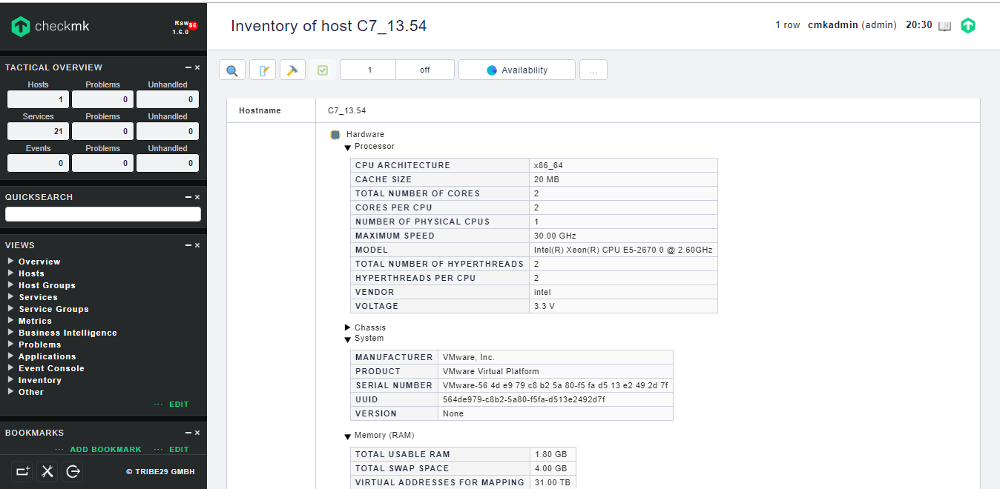

# Ghi chép lại các bước setup add inventory hardware monitor server vật lý.

Ngữ cảnh sử dụng: Server vật lý gồm rất nhiều các thành phần như ram, disk, CPU, card network, thông tin về phần cứng cần phải thu thập. Check_mk có `Plugins` hỗ trợ cho việc thu thập các thông tin phần cứng của server. Dưới đây là hướng dẫn cơ bản cho việc thiết lập này.

### 1, Thao tác trên web check_mk 
 
- Tạo rule `Check_MK Hardware/Software-Inventory`

Click `Check plugins` -> Tìm kiếm `inventory`


Click `Check_MK Hardware/Software-Inventory`


Click `Do hardware/software inventory`


Click `Create rule in folder`


Bạn có thể tùy chỉnh rule cho folder nào đó hoặc tất cả các host.

Tùy chỉnh các thông tin


Apply change


### 2, Thao tác trên client

Sử dụng local check phía client

```
wget -O /usr/lib/check_mk_agent/local/mk_inventory  http://mon.cloud365.vn/mon/check_mk/agents/plugins/mk_inventory.linux
chmod +x /usr/lib/check_mk_agent/local/mk_inventory
cd /usr/lib/check_mk_agent/local/
./mk_inventory
```


Lúc này trên giao diện web check_mk sẽ hiển thị nhưng thông số về hardware inventory thu thập được.





