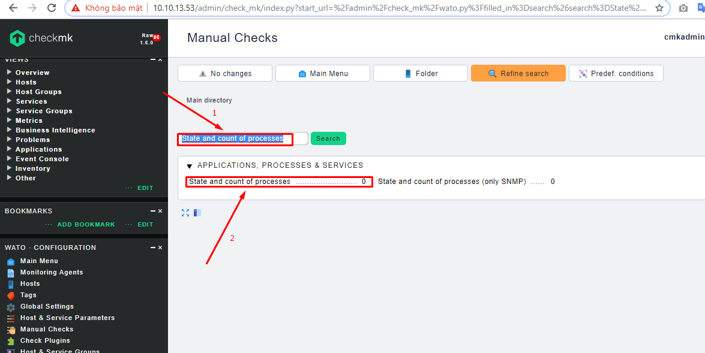

# Ghi chép lại các bước monitoring process linux bởi check_mk

Ngữ cảnh sử dụng: Trong check_mk có rất nhiều tiến trình process chạy (sshd, httpd, mysql...) có thể biết chính xác được các tiến trình đó đang được sử dụng thế nào ta thường dùng câu lệnh `ps` cộng thêm các option và `grep` để cho ta kết quả mong muốn (`ps -ef | grep httpd`, `pidof httpd | wc -w`). Check_mk đã hỗ trợ check các thông số này thông qua kiểu `manual check`. Dưới đây là các bước thực hiện cơ bản ví dụ để giảm giám process httpd.

### Thao tác trên giao diện web WATO check_mk

- Click `Manual Checks` -> `Application Processes & Services` -> `State and count of processes`

- Tìm kiếm nhanh `State and count of processes`

- Tạo rule cho việc check service

`Create rule in folder`

Có thể thiết lập rất nhiều tham số theo kinh nghiệm của bạn.

`RULE PROPERTIES`: Mô tả chung cho rule

`PARAMETERS`: Thiết lập các tham số phù hợp.

Command regex`.*usr/sbin/httpd*`

- Apply change

- Kết quả đã giám sát được về process httpd.

### Monitor process mysql

- Thực hiện rules cho process mysql

Command regex `.*usr/libexec/mysqld*`

- Save, apply change

- Kết quả đã giám sát được về process mysql.

