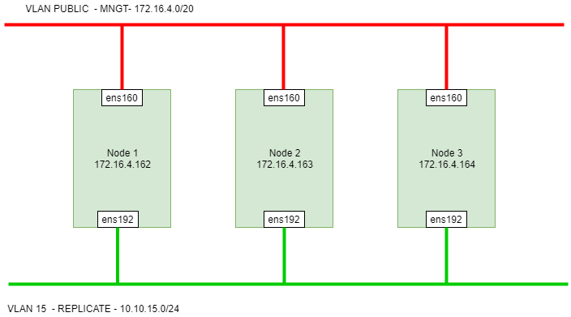
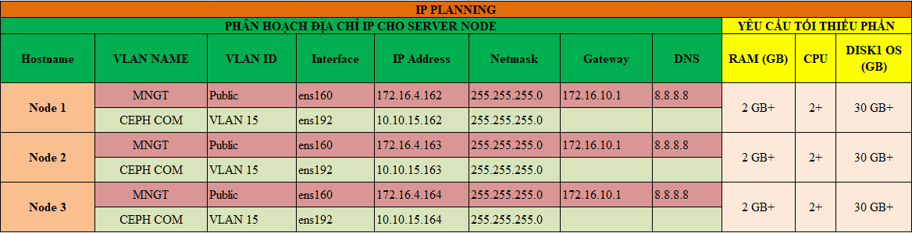

## Ghi chép cài đặt Galera database 3 node CentOS7

### Mục lục

[1. Tổng quan Maria Galera Cluster](#tongquan)<br>
[2. Mô hình triển khai](#mohinh)<br>
[3. IP Planning](#planning)<br>
[4. Thiết lập ban đầu](#thietlap)<br>
[5. Cài đặt](#caidat)<br>

<a name="tongquan"></a>
## 1. Tổng quan Maria Galera Cluster

`MariaDB` có thể hiểu là một nhánh tách ra của MySQL với một số tính năng cao hơn. MariaDB có một công cụ tạo ra nhiều bản sao giống hệt nhau trên nhiều máy chủ khác nhau, phục vụ cho mục đích backup dữ liệu, gọi là Maria Galera Cluster. Về mặt kiến trúc thì Maria Galera Cluster tương tự với Mysql Cluster. Galera hỗ trợ chế độ Active-Active tức có thể truy cập, ghi dữ liệu đồng thời trên tất các node MariaDB thuộc Galera Cluster.

Maria Galera Cluster tự động đồng bộ trong nội bộ cụm mà node nào cũng có thể coi là master.

Galera Cluster được đóng gói sẵn trong bản MariaDB từ 10.1 trở lên, và phát hành riêng với bản 10.0 hoặc 5.5

Galera cluster là một giải pháp multi master cho database. Sử dụng galera cluster, application có thể read/write trên bất cứ node nào. Một node có thể được thêm vào cluster cũng như gỡ ra khỏi cluster mà không có downtime dịch vụ, cách thức cũng đơn giản.

Nội tại database như mariadb không có tính năng multi master được tích hợp sẵn bên trong. Các database này sẽ sử dụng một galera replication plugin để sử dụng tính năng multi master do galera cluster cung cấp. Về bản chất, galera replication plugin sử dụng một phiên bản mở rộng của mysql replication api, bản mở rộng này có tên là wsrep api.

Dùng wsrep api, galera cluster sẽ thực hiện được certification based replication, một kỹ thuật cho phép thực hiện multi master trên nhiều node. Một writeset, chính là một transaction cần được replication trên các node. Transaction này sẽ được certificate trên từng node nhận được (qua replication) xem có conflict với bất cứ transaction nào đang có trong queue của node đó không. Nếu có thì replicated writeset này sẽ bị node discard. Nếu không thì replicated writeset này sẽ được applied. Một transaction chỉ xem là commit sau khi đã pass qua bước certificate trên tất cả các node. Điều này đảm bảo transaction đó đã được phân phối trên tất cả các node.

Hướng tiếp cận này gọi là virtual synchronous replication. Thực tế, một transaction sẽ được replicate đến tất cả các node để thực hiện certificate, nhưng sau đó, trong trường hợp pass qua tất cả các certification, quá trình apply writeset trên các node lại bất đồng bộ vì rất nhiều nguyên nhân khác nhau như năng lực xử lý các node khác nhau, do switch context của CPU… Apply writeset (quá trình data thực sự được ghi xuống table) giữa các node bất đồng bộ do đó là hiện tượng tự nhiên.

**Ưu điểm có được khi sử dụng galera**
+ Một giải pháp multi master hoàn chỉnh nên cho phép read/write trên node bất kỳ

+ Synchronous replication.

+ Multi thread slave cho phép apply writeset nhanh hơn

+ Không cần failover vì node nào cũng là master rồi.

+ Automatic node provisioning: Bản thân hệ database đã tự backup cho nhau. Tuy nhiên, khả năng backup tự nhiên của galera cluster không loại trừ được các sự cố do con người gây ra như xóa nhầm data.

+ Hỗ trợ innodb.

+ Hoàn toàn trong suốt với application nên application không cần sửa đổi gì

+ Không có Single point of failure vì bất cứ node nào trong hệ cluster cũng là master.

**Nhược điểm**

+ Không scale up về dung lượng. Một galera cluster có ba node thì cả ba node đó cùng có một data giống hệt nhau. Dung lượng lưu trữ của cả cluster sẽ phụ thuộc vào khả năng lưu trữ trên từng node.

+ Không hỗ trợ MyISAM, chuyển đổi một database sử dụng các myisam table sang innodb để sử dụng galera cluster sẽ khó khăn.

+ Xuất hiện hiện tượng stale data do bất đồng bộ khi apply writeset trên các node.

**Lưu ý**

`WSREP has not yet prepared node for application use`, log cho biết cluster đang bị split brain và truy vấn đang được thực hiện trong nhóm thiểu số (‘bad' part, smaller part). Thông báo này để ngăn chặn các thay đổi xảy ra trên smaller part. 
Nếu sau khi bị split brain, trên nhóm đa số (‘good’ part, larger part) có sự thay đổi thì một yêu cầu resync từ nhóm đa số sang nhóm thiểu số sẽ được thực hiện, các node trong nhóm thiểu số sẽ drop client connection khi thực hiện đồng bộ này.

<a name="mohinh"></a>
## 2. Mô hình triển khai


**OS** : CentOS7 - 64 bit<br>
**Disk**: 30GB <br>
**NICs**:<br>
	ens160: dùng để ssh và tải gói cài đặt<br>
	ens192: dùng để replicate DB<br>
	


<a name="planning"></a>
## 3. IP Planning
	


**Update**

```
yum install epel-release -y
yum update -y
```

**Cấu hình IP**

Thực hiện trên 3 node với IP đã được quy hoạch cho các node ở mục 2.

```
nmcli c modify ens160 ipv4.addresses 172.16.4.162/24
nmcli c modify ens160 ipv4.gateway 172.16.10.1
nmcli c modify ens160 ipv4.dns 8.8.8.8
nmcli c modify ens160 ipv4.method manual
nmcli con mod ens160 connection.autoconnect yes

nmcli c modify ens192 ipv4.addresses 10.10.15.162/24
nmcli c modify ens192 ipv4.method manual
nmcli con mod ens192 connection.autoconnect yes


sudo systemctl disable firewalld
sudo systemctl stop firewalld
sudo systemctl disable NetworkManager
sudo systemctl stop NetworkManager
sudo systemctl enable network
sudo systemctl start network
sed -i 's/SELINUX=enforcing/SELINUX=disabled/g' /etc/sysconfig/selinux
sed -i 's/SELINUX=enforcing/SELINUX=disabled/g' /etc/selinux/config
init 6
```


### Tham khảo

http://coffeecode101.blogspot.com/2016/01/gioi-thieu-galera-cluster.html

