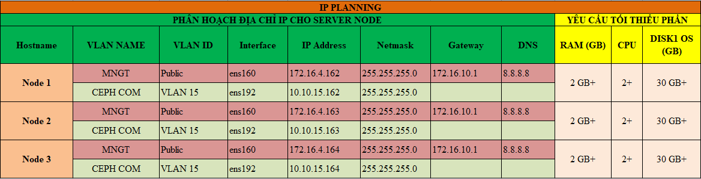

## Ghi chép cài đặt Galera database 3 node CentOS7

### Mục lục

[1. Mô hình triển khai](#mohinh)<br>
[2. IP Planning](#planning)<br>
[3. Thiết lập ban đầu](#thietlap)<br>
[4. Cài đặt](#caidat)<br>

<a name="mohinh"></a>
## 1. Mô hình triển khai


**OS** : CentOS7 - 64 bit<br>
**Disk**: 30GB <br>
**NICs**:<br>
	ens160: dùng để ssh và tải gói cài đặt<br>
	ens192: dùng để replicate DB<br>
	


<a name="planning"></a>
## 2. IP Planning
	


**Update**

```
yum install epel-release -y
yum update -y
```

**Cấu hình IP**

Thực hiện trên 3 node với IP đã được quy hoạch cho các node ở mục 2.

```
nmcli c modify ens160 ipv4.addresses 172.16.4.162/24
nmcli c modify ens160 ipv4.gateway 172.16.10.1
nmcli c modify ens160 ipv4.dns 8.8.8.8
nmcli c modify ens160 ipv4.method manual
nmcli con mod ens160 connection.autoconnect yes

nmcli c modify ens192 ipv4.addresses 10.10.15.162/24
nmcli c modify ens192 ipv4.method manual
nmcli con mod ens192 connection.autoconnect yes


sudo systemctl disable firewalld
sudo systemctl stop firewalld
sudo systemctl disable NetworkManager
sudo systemctl stop NetworkManager
sudo systemctl enable network
sudo systemctl start network
sed -i 's/SELINUX=enforcing/SELINUX=disabled/g' /etc/sysconfig/selinux
sed -i 's/SELINUX=enforcing/SELINUX=disabled/g' /etc/selinux/config
init 6
```