# Ghi chép lại các bước cài đặt Email server Zimbra

### Mục lục

[1. Chuẩn bị](#chuanbi)<br>
[2. Cài đặt](#caidat)<br>
[3. Cài đặt SSL cho zimbra](#ssl)<br>

<a name="chuanbi"></a>
## 1. Chuẩn bị

- Một server hoặc máy ảo:

```
OS: CentOS 7
IP: 103.101.160.161
CPU: 4
RAM: 3GB
DISK: 60GB
```

- Một domain

Sử dụng bài lab domain: `techvn.top`

<a name="caidat"></a>
## 2. Cài đặt

**Bước 1: Thiết lập bản ghị DNS**

Vào trang quản lý tên miền để thiết lập các bản ghi email về IP của VPS, tùy vào domain đăng ký ở đâu để có các thao tác add bản ghi khác nhau. Với domain `techvn.top` đang có được đăng ký ở Nhân Hòa tôi sử dụng trang quản lsy DNS của Nhân Hòa để thiết lập các bản ghi.

- Bản ghi A

```
Host	Type	Value	        MX	  TTL
mail	A	103.101.160.161		   300
```

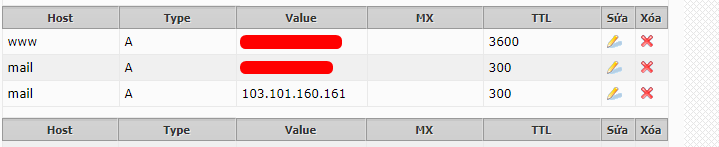

- Bản ghị CNAME


```
Host	        Type	Value	          MX	TTL
autodiscover	CNAME	mail.techvn.top.300		
autoconfig	 CNAME	mail.techvn.top.	300
```

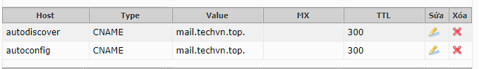

- Bản ghị MX

```
Host	   Type   	Value	          MX	TTL
@	    MX	   mail.techvn.top.  10	 300
```

```
Host	        Type	Value	                 MX	  TTL
mail	         A	    103.101.160.161	 
autodiscover	CNAME	mail.techvn.top.	 
autoconfig	CNAME	mail.techvn.top.	 
@	         MX	   mail.techvn.top.	10
```
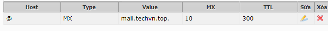

Tùy thuộc và hệ thống, chờ một lúc để các bản ghi được cập nhật và kiểm tra.

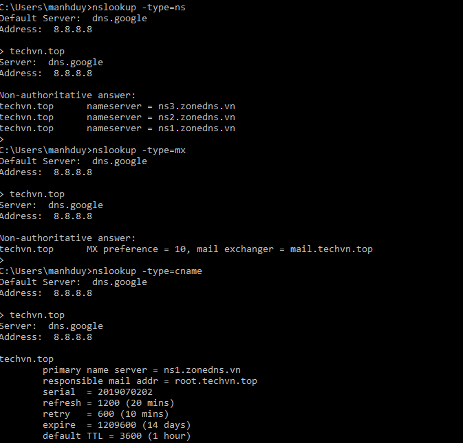

**Bước 2: Update, chỉnh sửa hostname**

- Update

```
yum install epel-release -y
yum update -y
init 6
```

- Chỉnh sửa hostsname

```
hostnamectl set-hostname mail.techvn.top
exec bash
```

- Sửa file /etc/hosts

```
vi /etc/hosts 
103.101.160.161 mail.techvn.top mail
```

- Kiểm tra xem có dịch vụ nào chạy port của zimbra không.

```
netstat -tulpn | grep -E -w '25|80|110|143|443|465|587|993|995|5222|5223|9071|7071'
```

Không có là ok tránh lỗi trong quá trình khởi động service (nếu có port chạy phải tắt đi hoặc xóa đi).

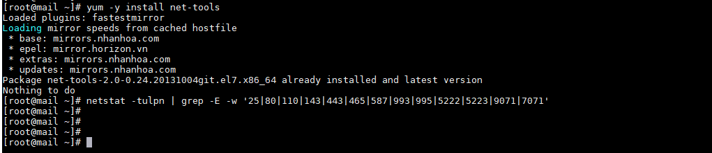

- Install bind

```
yum install bind-utils -y
```

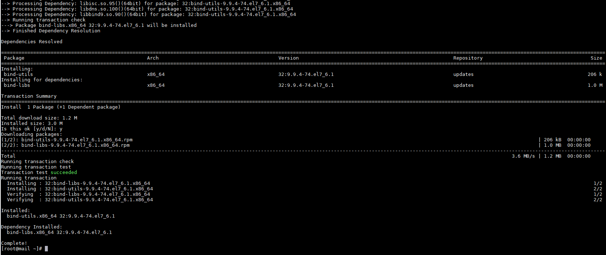

- Kiểm tra lại bản ghi với domain sử dụng

```
dig -t A mail.techvn.top
dig -t MX techvn.top
```

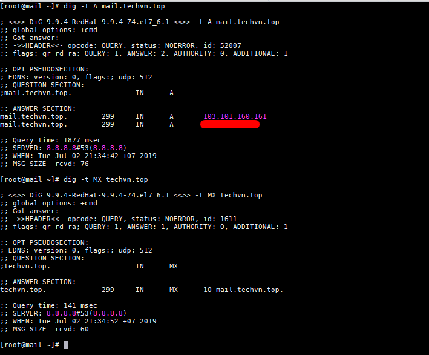

**Bước 3: Cài đặt zimbra**

- Cài đặt một số package

```
yum install unzip net-tools sysstat openssh-clients perl-core libaio nmap-ncat libstdc++.so.6 wget -y
```

- Tải gói cài đặt zimbra

```
mkdir zimbra && cd zimbra
wget https://files.zimbra.com/downloads/8.8.10_GA/zcs-8.8.10_GA_3039.RHEL7_64.20180928094617.tgz --no-check-certificate
```

- Giải nén và cài đặt zimbra

```
tar zxpvf zcs-8.8.10_GA_3039.RHEL7_64.20180928094617.tgz
cd zcs-8.8.10_GA_3039.RHEL7_64.20180928094617
./install.sh
```

Lựa chon `Y` trong lúc  cài đặt.

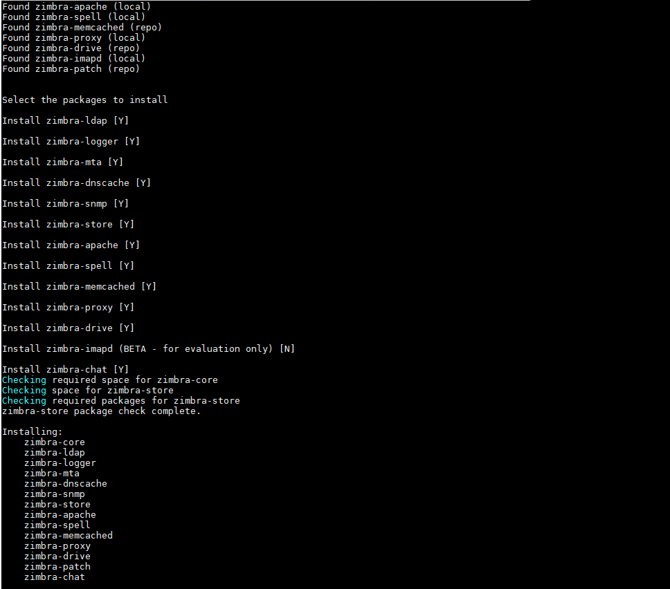

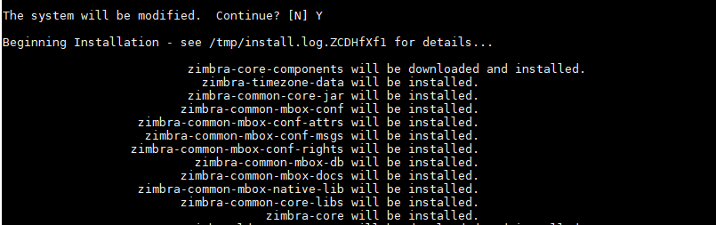

- Khai báo domain. Create lại tên domain định dạng `techvn.top`

```
It is suggested that the domain name have an MX record configured in DNS
Change domain name? [Yes]
```

Lựa chọn `yes`

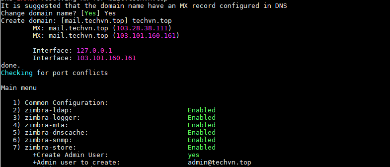

- Chọn `7` và chọn `4` để thiết lập tài khoản admin

- Chọn `r` để xem lại cài đặt, chọn `a` để lưu thay đổi

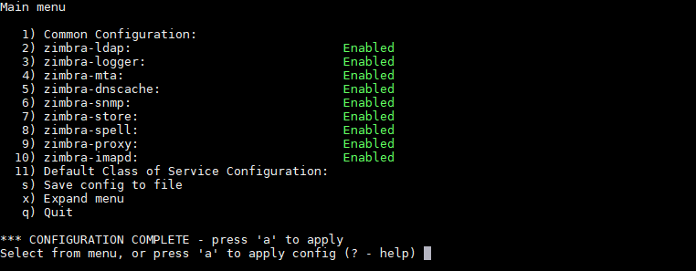

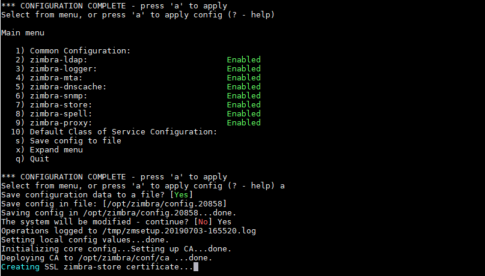

- Chọn `q` để thoát và `Yes` để lưu.

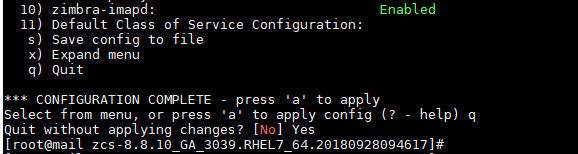

Bước 4: Truy cập giao diện admin của zimbra

```
https://mail.techvn.top:7071
```

hoặc

```
https://103.101.160.161:7071/
```

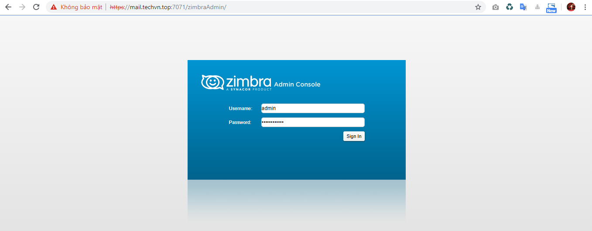

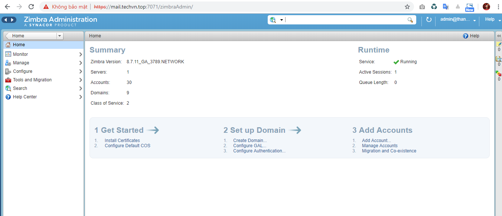

**Bước 4: Thiết lập các bản ghi DKIM, DMARC**

```
/opt/zimbra/libexec/zmdkimkeyutil -a -d techvn.top
```

```
[zimbra@mail ~]$ /opt/zimbra/libexec/zmdkimkeyutil -a -d techvn.top
DKIM Data added to LDAP for domain techvn.top with selector 5BB5B170-9D76-11E9-AB44-ADC947E7045C
Public signature to enter into DNS:
5BB5B170-9D76-11E9-AB44-ADC947E7045C._domainkey IN      TXT     ( "v=DKIM1; k=rsa; "
          "p=MIIBIjANBgkqhkiG9w0BAQEFAAOCAQ8AMIIBCgKCAQEApKWfI5hg2iqZQ5ehK2oEe/R70YBo+dsSiuu2zkYTN9hbiZuG7UaQYyzvrMUpfh9otcIUJAtFHY7N/0wIEpUIpYekM+Zp5SjxGpZECkeinatY/lFfwUR8Kebuzg9Hx53sAIN1+x1tsHJFPImYhZEhTa7DK9qLWAdRwyoHGbkhhGwzhhjsz45bqYL1IdGWgtzLE6o+ldju8TjgwR"
          "L2iQJUv+mkB6bzxUMRLmYk+22rultQ/bIdVGoggfmVL+1SH7xTy9rGJ8e0fYgny3w80KURQOph5k0XTbPdPP6Kfn4UQULUekkuFAjdvcO7VgkDrIGevCobS3ISaKMLXjmuaLXI+QIDAQAB" )  ; ----- DKIM key 5BB5B170-9D76-11E9-AB44-ADC947E7045C for techvn.top

```

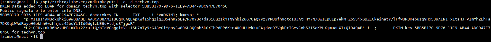

- Khai báo lại các thông tin DNS add các bản ghi

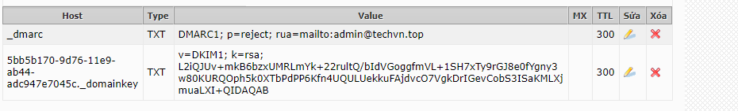

<a name="ssl"></a>
## 3. Cài đặt SSL cho zimbra

Tham khảo

https://www.linuxtechi.com/install-opensource-zimbra-mailserver-centos-7/
