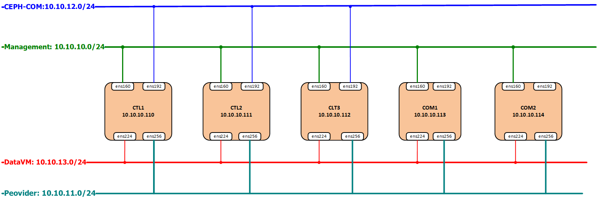
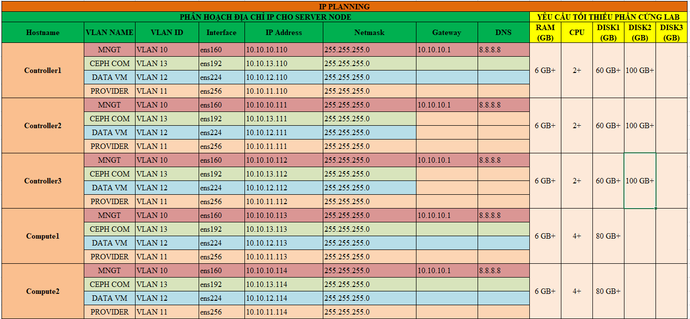
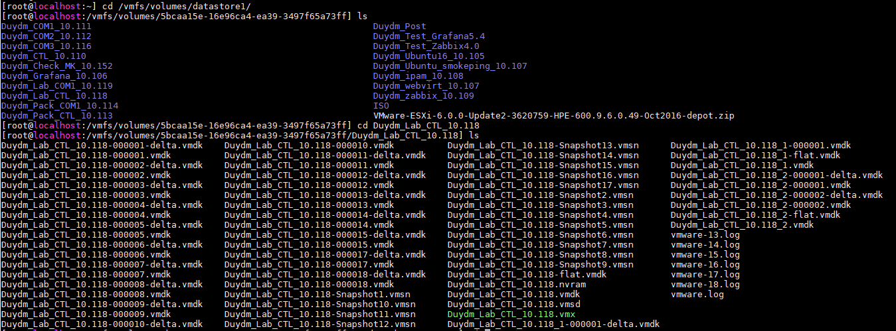
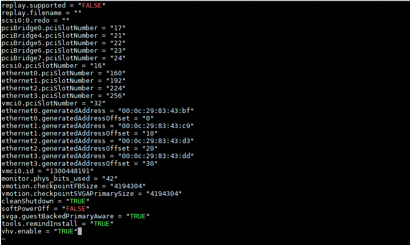
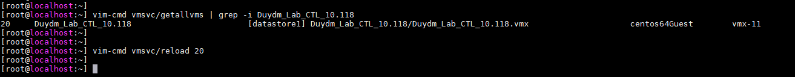
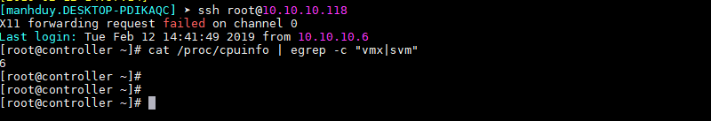

# Ghi chép lại các bước cài đặt HA 3 node controller Openstack Queen CentOS 7 trên môi trường VMware ESXi 6.0.0

### Mục lục

[1. Mô hình triển khai](#mohinh)<br>
[2. IP Planning](#planning)<br>
[3. Thiết lập ban đầu](#thietlap)<br>
[4. Cài đặt node controller1](#controller1)<br>
[4. Cài đặt node controller2](#controller2)<br>
[4. Cài đặt node controller3](#controller3)<br>
[5. Cài đặt node compute](#compute)<br>
[6. Truy cập dashboard horizon](#dashboard)<br>

<a name="mohinh"></a>
## 1. Mô hình triển khai



<a name="planning"></a>
## 2. IP Planning



## 3. Thiết lập ban đầu

**Bật chế độ ảo hóa trong vm trên ESXi**<br>
Ở đây triển khai trên môi trường ảo hóa VMware nên ta phải bật mode ảo hóa đối với máy ảo được tạo ra trên VMware ESXi. Thực hiện và kiểm tra trên cả ba node trển khai Openstack.

+ Sau khi cài đặt xong CentOS 7 tiến hành shutoff và cấu hình enable vmx cho KVM Node trên ESXi Node.

+ SSH vào node VMware di chuyển tới thư mục: `/vmfs/volumes/datastore_name`. Bên trong này sẽ chứa tất cả các file của VM được tạo.

```
cd /vmfs/volumes/datastore_name/Name_VMVKM
```
datastore_name tùy thuộc vào trên của phân vùng lưu trữ disk của VMware



+ Edit file `VM-name.vmx`

Add thêm dòng sau vào cuối file

```
vhv.enable = "TRUE"
```


+ Kiểm tra ID của VM và reload lại VM vừa sửa file VM-name.vmx

```
vim-cmd vmsvc/getallvms | grep -i <name> 
vim-cmd vmsvc/reload <id>
```



+ Bật VM và kiểm tra

```
cat /proc/cpuinfo | egrep -c "vmx|svm"
```

Nếu OUTPUT câu lệnh trên >0 thì đã enable vmx OK



