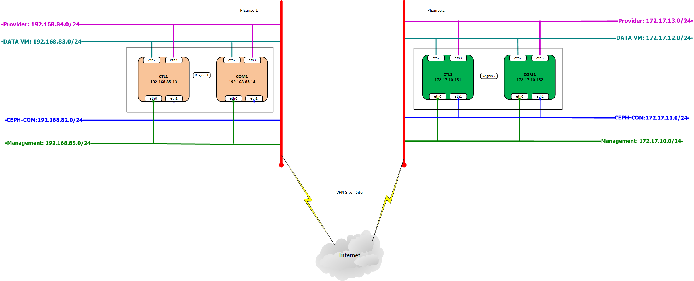
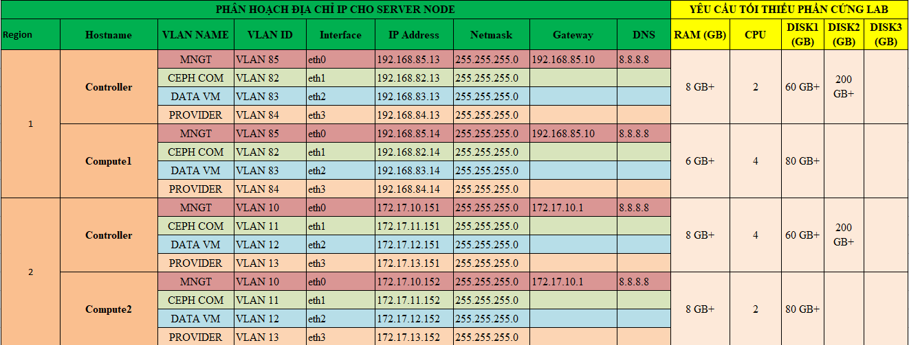

# Ghi chép lại các bước cài đặt Openstack multiple Region - Pfsense

### Mục lục

[1. Mô hình triển khai](#mohinh) 
[2. IP Planning](#planning) 

## 1. Mô hình triển khai

## 2. IP Planning

Hình ảnh ở dưới thể hiện phân hoạch địa chỉ IP và cấu hình tối thiểu cho các node cài đặt.

## 3. Cài đặt openstack multiple region 

Cài đặt tương tự theo hướng dẫn [tại đây](https://github.com/domanhduy/ghichep/blob/master/DuyDM/Openstack/install-openstack/docs/multipe-region.md)

