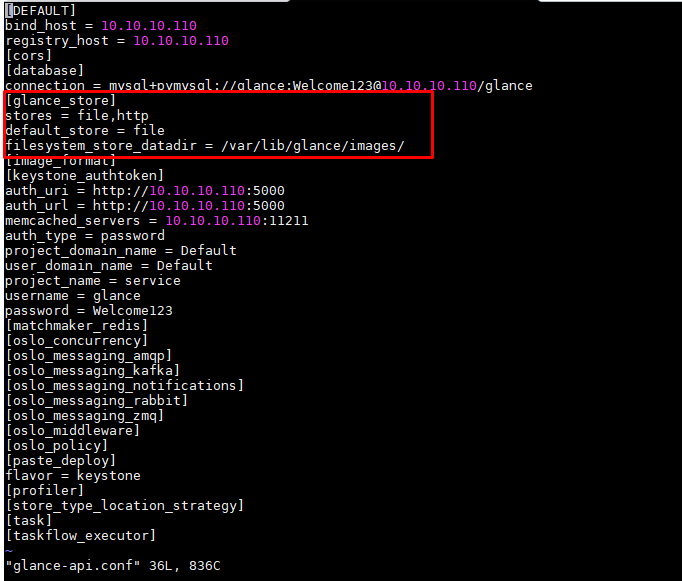
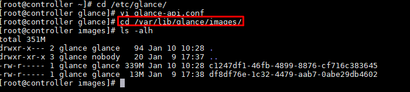
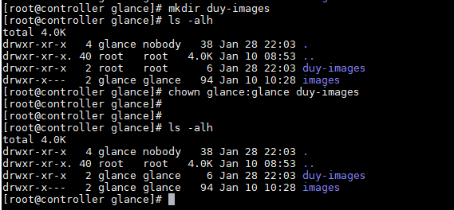
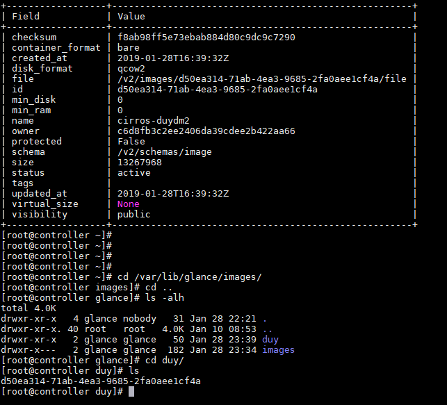
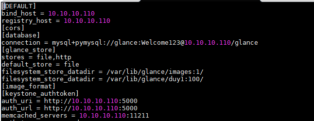
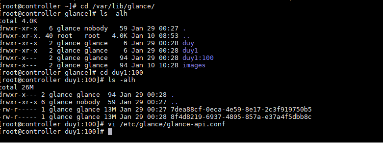
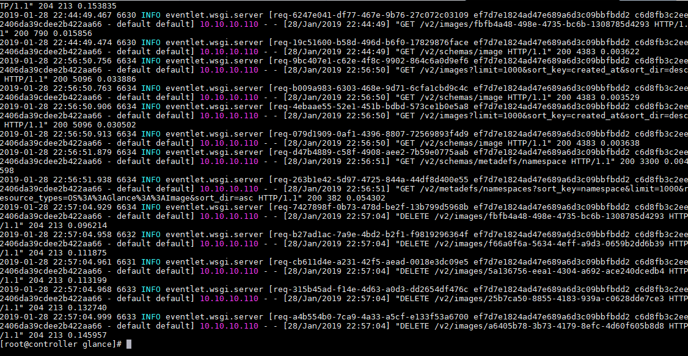
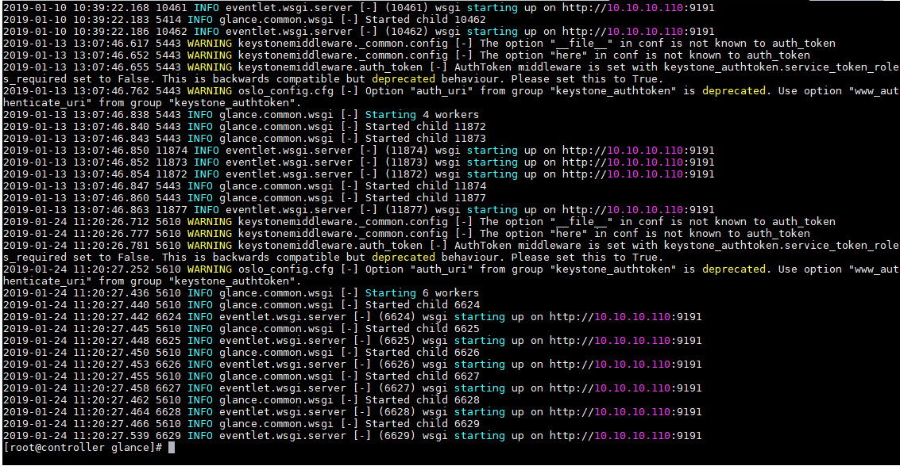

# Ghi chép training project glance


## 1. Tổng quan

OS Glance quản lý các file disk image ảo. Bạn có thể cập nhật, cấu hình quyền riêng tư và điều khiển quyền truy cập, thêm sửa xóa các virtual disk images có định dạng Raw, Virtual Box (VDI), VMWare (VMDK, OVF), Hyper-V(VHD),…

Glace Registry để lưu metadata của các image và Glance API để tiếp nhận request và chuyển đến đúng các Image Store end. Các file image (là các file nén lưu trạng thái của os và fs tại 1 thời điểm nhất định, ví dụ như file .iso) có thể lưu bằng Swift, local file system, S3(Simple Storage System) hoặc lưu tại một nơi nào đó trên internet và được tương tác thông qua http. Glance có thể sử dụng chung với Keystone (Openstack Identity service) để thực hiện chức năng xác minh người dùng. Người dùng có thể đem các image của mình share với người khác bằng cách thiết lập thuộc tính public của image bằng 1.

Image service cho phép client sử dụng, đăng kí, truy xuất các virtual machine images. Service cung cấp một API REST cho phép truy vấn virtual machine images và image thực. Có thể lưu trữ các image thông qua image service ở địa điểm khác nhau từ các hệ thống đơn giản đến các hệ thống lưu trữ như Openstack Object Storage

Openstack image là trung tâm chính của IaaS, nó chấp nhận các yêu cầu API cho image server, disk và metadata từ người dùng cuối hoặc OP  compute component. Hỗ trợ lưu trữ trên storage của disk hoặc server image trên repo type khác nhhau. Các tiến trình bao gồm auditors, updaters, reapers.

- Các thành phần trong image service:

+Glance-api: Chấp nhận image API gọi để discovery, retrieval, storage image.

+Glance-registry: Lưu trữ, xử lý và truy xuất metadata về image. Metadata bao gồm như size, type

+Database: Lưu trữ metadata image có thể sử dụng nhiều DB.

+Storage repo for image file: Các repo lưu trữ khác nhau được hỗ trợ có thể là hệ thống tệp thông thường, bộ nhớ trong đối tượng, RADOS. Một số repo chỉ hỗ trợ việc sử dụng chỉ đọc.

+Metadata definition service: API dành cho nhà cung cấp, quản trị, dịch vụ và người dùng để xác định metadata.

## 2. Thực hành

### 2.1. Cấu hình lưu trữ

Có thể hiểu là cấu hình cách thức và nơi để lưu trữ các image ở đó, để quá trình tạo VM gọi xuống đó để lấy các image đó lên tạo VM.

Dòng cấu hình lưu trữ ở file `glance-api.conf` trong thư mục `/etc/glance/`

```
[glance_store]
stores = file,http
default_store = file
```

2 dòng cấu hình cần phải maps cho nhau:

stores: Ý nghĩ hỗ trợ lưu trữ đối với image, mặc định là file. Có thể lưu trữ theo các kiểu khác :file, swift, rbd, sheepdog, cinder.Lưu được định dạng nào (trên là các opption)

default_store: mặc định, phải khai báo tương ứng ở trên.(chỉ có 1)

+ Đường dẫn lưu trữ file image

```
filesystem_store_datadir = /var/lib/glance/images/
```




+ Thay đổi thư mục chứ file image



```
filesystem_store_datadir = /var/lib/glance/duy/
```

```
chown glance:glance /var/lib/glance/duy/
```

Restart service

```
systemctl restart openstack-glance-api.service
```

```
openstack image create "cirros-duydm2" \
  --file cirros-0.3.5-x86_64-disk.img \
  --disk-format qcow2 --container-format bare \
  --public
```


```
systemctl restart openstack-glance-api.service openstack-glance-registry.service
```


### 2.2. Cấu hình backend multiple store về filesystem

multiple store không phải là nhiều kiểu lưu trữ cho image mà là nhiều thư mục để lưu trự image.
Tùy chọn filesystem_store_datadirs cho phép người quản trị admin cấu hình đa thư mục lưu trữ để lưu trữ các glance image trong hệ thống backend filesystem. Chỉ áp dụng cho lưu trữ kiểu file.

Chỉnh sửa trong file glance-api.conf

```
filesystem_store_datadirs=PATH:PRIORITY
```

/var/lib/glance/images/:1 được gán với độ ưu tiên là 1 thấp nhất

```
filesystem_store_datadirs = /var/glance/duy
filesystem_store_datadirs = /var/glance/duy1:100
```
Tạo các folder khác nhau



Image mới tạo sẽ vào thưc mục có độ ưu tiên cao.



### 2.3. Cấu hình maximum size image

### 2.4. Giới hạn quota up image cho user

### 2.5. Cấu hình sử dụng glance cache

### 2.6. Tạo image từ file snapshot

O bytes sử dụng cơ chế backend, chỉ chứa metadata theo cơ chế LVM


### 2.6. File log glance

Có hai file log lưu trong thư mục `/var/log/glance/`:

+ glance-api.log: ghi lại log truy cập api server (tạo, xóa, lấy thông tin image)



+ glance-registry.log : ghi lại log liên quan tới registry server



## 3. Tham khảo

https://github.com/hocchudong/thuctap012017/blob/master/TamNT/Openstack/Glance/docs/1.Tim_hieu_Glance_trong_Openstack.md
