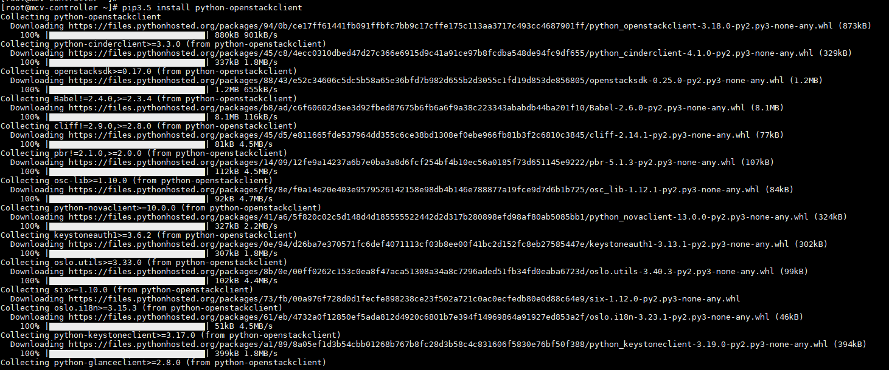
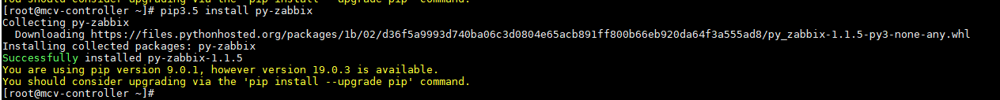
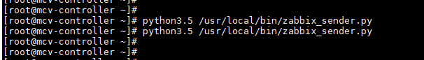
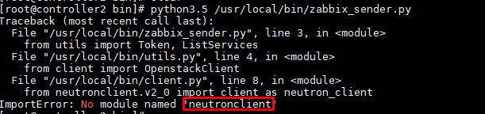
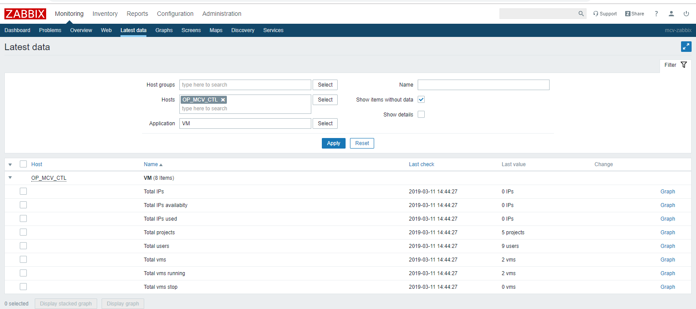

# Hướng dẫn lấy thông tin VM, Volume opentack zabbix

## 1. Thực hiện trên node Controller

- Cài đặt môi trường python3.5

```
yum -y install https://centos7.iuscommunity.org/ius-release.rpm
yum -y install python35u
yum -y install python35u-pip
yum install python35u-devel -y
```

```
pip3.5 install python-openstackclient
```



```
pip3.5 install py-zabbix
```



Cài đặt zabbix sender

```
yum install zabbix-sender
```

- Lấy các file scripts python về để vào thư mục `/usr/local/bin/`

+ File scripts để ở thư mục scripts

+ `chmod +x` cho các file scripts

+ Thực hiện chỉnh sửa 

File `config.cfg` thông tin đăng nhập project admin của OP

File `zabbix_sender.py` chỉnh sửa thông tin về zabbix

```
zserver = '192.168.70.xxx'
port = 10051
hostId = 'hosname_add_host_zabbix'
```

Khai báo crontabs

```
0 * * * * /usr/local/bin/zabbix_sender.py
```

## 2. Import template Openstack zabbix vào zabbix

Tempalate `zbx_export_templates.xml` để ở thư mục scripts

```
python3.5 /usr/local/bin/zabbix_sender.py
```



Không báo lỗi là ok.

**Lưu ý:** Nếu báo lỗi sau phải cài thêm gói `neutronclient`



```
pip3.5 install python-neutronclient
```


## 4. Kết quả



