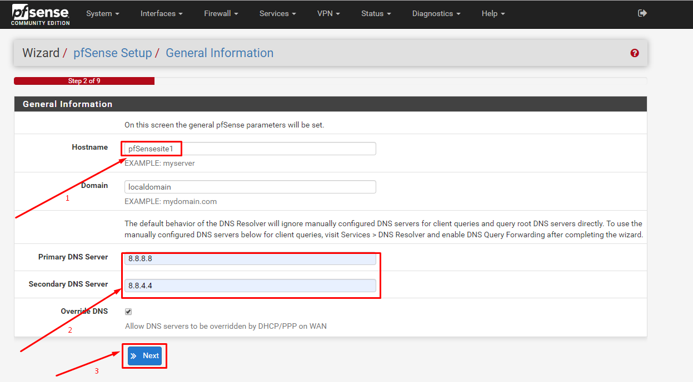

# Ghi chép lại các bước cài đặt pfsense multiple site

### Mục lục

[1. Mô hình triển khai](#mohinh)<br>
[2. IP Planning](#planning)<br>
[3. Cài đặt pfsense](#setup)<br>
[4. Config vpn site-to-site](#setup)<br>

## 1. Mô hình triển khai

## 2. IP Planning

## 3. Cài đặt pfsense

Thực hiện cài đặt 2 cụm pssense với các VLAN đã được quy hoạch

### 3.1. Cài đặt pfsense

- Chuẩn bị VM

```
+ vCPU: 4
+ RAM: 6 GB
+ Disk: 30 GB
+ Network: 1 public, n local (n tùy ý)

```

- Cài đặt conmand line


Lựa chọn `No`


- Config IP WAN,lựa chọn https, cho fpsense


- Truy cập config giao diện

```
https://ip
```

Thông tin mặc định `admin\pfsense`





Tạm thời để mặc định và click `Next`


Đổi pass mặc định sang pass khác có độ khó cao hơn


- Update để lên bản mới để cập nhất các package


Chờ quá trình update hoàn tất

- Add tất cả các VLAN còn lại trên giao diện pfsense theo mô hình


- Thực hiện cài ở 2 site giống nhau

## Bước 2: Cài đặt OpenVPN để client connect tới theo mô hình truyền thống.

## Bước 3: Cấu hình site-to-site


Một số lưu ý:

Rule phải mở ở 2 site giống nhau

+ WAN


+ VLAN


+ VPN


+ IPsec


+ OpenVPN


