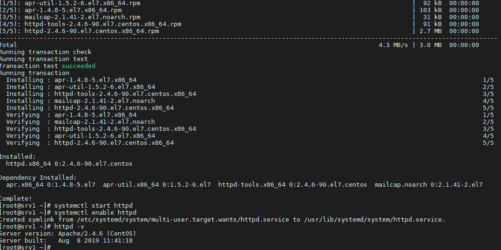
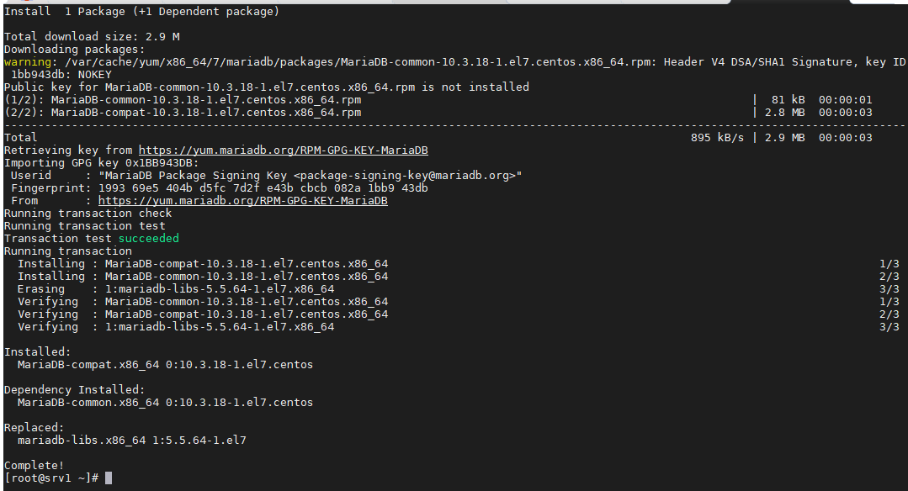
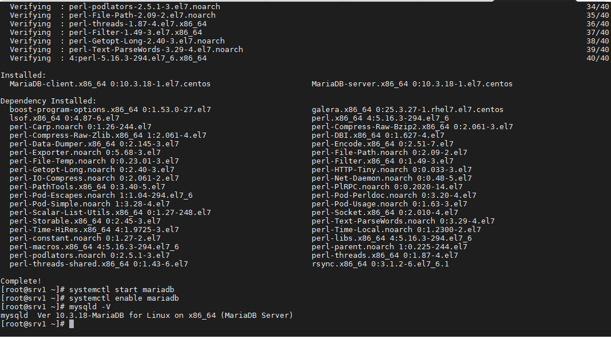
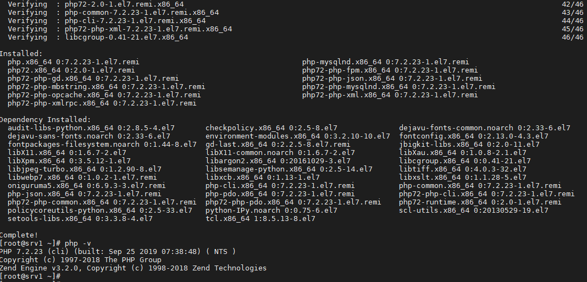
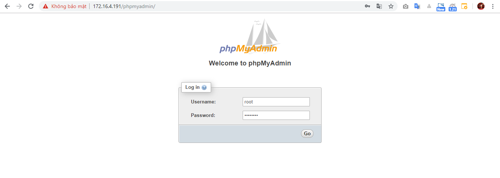
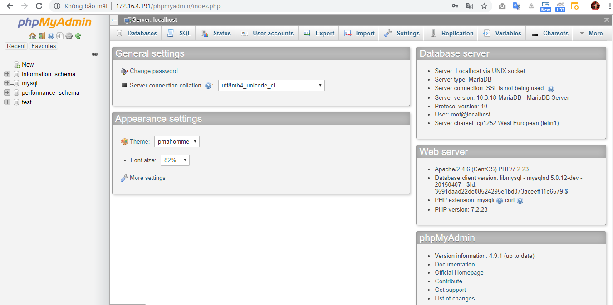
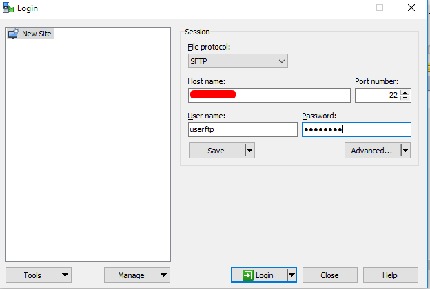
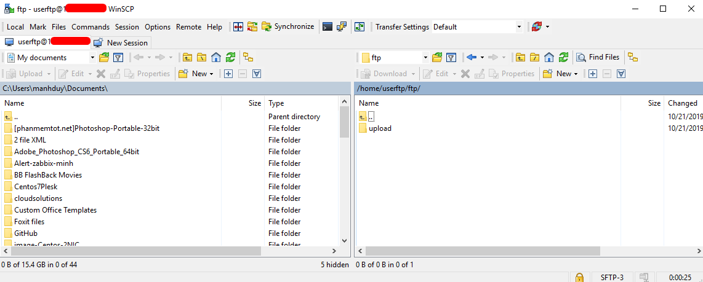

## Ghi chép lại các bước cài đặt LAMP server (Apache, Mysql, php, php-myadmin)

### 1. Chuẩn bị

- Cấu hình

```
OS: CentOS7
RAM: 2GB
CPU: 2vCPU
Disk: 50Gb
```

- Update, disable firewalld, selinux, set IP, cmdlog, time
```
yum install epel-release -y
yum update -y
```

```
nmcli c modify eth0 ipv4.addresses 172.16.4.191/20
nmcli c modify eth0 ipv4.gateway 172.16.10.1
nmcli c modify eth0 ipv4.dns 8.8.8.8
nmcli c modify eth0 ipv4.method manual
nmcli con mod eth0 connection.autoconnect yes
```

```
sudo systemctl disable firewalld
sudo systemctl stop firewalld
sudo systemctl disable NetworkManager
sudo systemctl stop NetworkManager
sudo systemctl enable network
sudo systemctl start network
sed -i 's/SELINUX=enforcing/SELINUX=disabled/g' /etc/sysconfig/selinux
sed -i 's/SELINUX=enforcing/SELINUX=disabled/g' /etc/selinux/config
```

```
echo "net.ipv6.conf.all.disable_ipv6 = 1" >> /etc/sysctl.conf
echo "net.ipv6.conf.default.disable_ipv6 = 1" >> /etc/sysctl.conf
sysctl -p
```

```
yum install chrony -y 
systemctl start chronyd 
systemctl enable chronyd
systemctl restart chronyd 
chronyc sources -v
```

```
curl -Lso- https://raw.githubusercontent.com/nhanhoadocs/ghichep-cmdlog/master/cmdlog.sh | bash
```

```
init 6
```

### 2. Cài đặt Apache

Cài đặt bản release mới nhất của httpd

```
yum install httpd -y
```

```
systemctl start httpd
systemctl enable httpd 
httpd -v
```



### 2. Cài đặt Mysql

**Ở đây mình cài MariaDb 10.3**

- Khai báo repo mariadb và update*

```
echo '[mariadb]
name = MariaDB
baseurl = http://yum.mariadb.org/10.3/centos73-amd64/
gpgkey=https://yum.mariadb.org/RPM-GPG-KEY-MariaDB
gpgcheck=1' >> /etc/yum.repos.d/MariaDB.repo
```

```
yum -y update
```


- Cài đặt mariadb

```
yum install MariaDB-server MariaDB-client -y
```

```
systemctl start mariadb
systemctl enable mariadb
mysqld -V
```


- Mặc định cài xong mysql không có password ta phải set pass root mysql

```
mysqladmin --user=root --password password 123456aA
```

Chạy lên trên xong `Enter` 1 cái.

Password mysql lúc này sẽ là `123456aA`

### 3. Cài đặt php

Ở đây mình cài php 7.2

- Update repo

```
yum install https://dl.fedoraproject.org/pub/epel/epel-release-latest-7.noarch.rpm
yum install yum-utils -y
yum install http://rpms.remirepo.net/enterprise/remi-release-7.rpm -y
yum-config-manager --enable remi-php72
```

- Cài đặt php

```
yum install php72 php72-php-fpm php72-php-mysqlnd php72-php-opcache php72-php-xml php72-php-xmlrpc php72-php-gd php72-php-mbstring php72-php-json php php-mysql -y
```

```
php -v
```



### 3. Cài đặt phpmyadmin

- Tạo miến môi trường thông tin của version muốn cài đặt

```
export VER="4.9.1"
```
- Download version

```
curl -o phpMyAdmin-${VER}-english.tar.gz  https://files.phpmyadmin.net/phpMyAdmin/${VER}/phpMyAdmin-${VER}-english.tar.gz
```

- Giải nén

```
gzip -d phpMyAdmin-4.9.1-english.tar.gz
tar -xvf phpMyAdmin-4.9.1-english.tar
```

- Chuyển các file mới được giải nén vào thư mục mặc định `/usr/share/phpmyadmin`

```
mv phpMyAdmin-4.9.1-english /usr/share/phpmyadmin
```

```
yum install install -y php-json -y
```

- Cấu hình phpmyadmin

Copy cấu hình mẫu

```
cp /usr/share/phpmyadmin/config.sample.inc.php /usr/share/phpmyadmin/config.inc.php
```

- Cấu hình Apache cho phép phpmyadmin kết nối.

```
tee /etc/httpd/conf.d/phpmyadmin.conf << EOF
# Apache configuration for phpMyAdmin
Alias /phpMyAdmin /usr/share/phpmyadmin/
Alias /phpmyadmin /usr/share/phpmyadmin/

<Directory /usr/share/phpmyadmin/>
   AddDefaultCharset UTF-8

   <IfModule mod_authz_core.c>
     # Apache 2.4
     Require all granted
   </IfModule>
   <IfModule !mod_authz_core.c>
     # Apache 2.2
     Order Deny,Allow
     Deny from All
     Allow from 127.0.0.1
     Allow from ::1
   </IfModule>
</Directory>
EOF
```

- Kiểm tra cấu hình apache

```
apachectl configtest
```

`Syntax OK` là cấu hình đã đúng cú pháp.

```
systemctl restart httpd
```

- Truy cập vào phpMyAdmin trên giao diện Web

```
http://ip_server/phpmyadmin
```



Nhập tài khoản mysql



### 4. Cài đặt vsftpd

- Cài đặt

```
yum install vsftpd -y
```

```
systemctl start vsftpd
systemctl enable vsftpd
```

- Tạo user ftp

```
adduser userftp
passwd userftp
```
Nhập passcho userftp

- Add user ftp vào `user_list`

```
echo "userftp" | sudo tee –a /etc/vsftpd/user_list
```

- Tạo thư mục để upload ftp và chỉnh sửa quyền (owner-group-other).

```
mkdir -p /home/userftp/ftp/upload
chmod 550 /home/userftp/ftp
chmod 750 /home/userftp/ftp/upload
sudo chown -R userftp: /home/userftp/ftp
```

- Test đẩy file qua sftp sử dụng `userftp`





Như vậy bạn đã cài đặt thành công LAMP webserver

- Tham khảo

https://www.rosehosting.com/blog/how-to-install-php-7-2-on-centos-7/

http://yallalabs.com/linux/how-to-install-mariadb-10-3-on-centosrhel-7/

https://news.cloud365.vn/huong-dan-cai-dat-phpmyadmin-v4-9-1-tren-centos-8/

https://phoenixnap.com/kb/how-to-setup-ftp-server-install-vsftpd-centos-7


