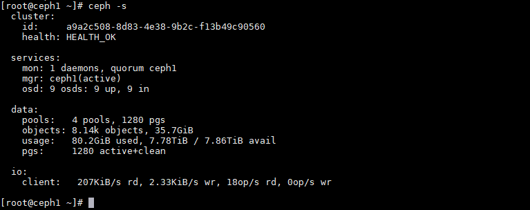
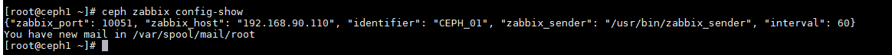

# Ghi chép một số bước monitor CEPH bằng phần mềm zabbix - grafana

### Mục lục

[1. Mô hình(#mohinh)<br>
[2. IP Planning](#planning)<br>
[3. Thao tác trên node CEPH](#nodeceph)<br>

<a name="mohinh"></a>
## 1. Mô hình triển khai

Mô hình triển khai gồm

+ 01 cụm CEPH<br>
+ 01 zabbix server<br>
+ 01 grafana server <br>


<a name="planning"></a>
## 2. IP Planning


<a name="nodeceph"></a>
## 3. Thao tác trên node CEPH

Thực hiện trên node CEPH cài service monitor của cụm CEPH



### Cài zabbix-sender

```
yum install zabbix-sender -y
```

Check

```
[root@nhcephssd1 ~]# which zabbix_sender
/usr/bin/zabbix_sender
```

### Setup module ceph-zabbix

+ Enable module ceph-zabbix

```
ceph mgr module enable zabbix
```

+ Set zabbix server

```
ceph zabbix config-set zabbix_host 192.168.90.110
```

+ Set ceph-server

```
ceph zabbix config-set identifier CEPH_01
```

+ Set zabbix_sender

Lấy đường dẫn
```
which zabbix_sender
```

```
ceph zabbix config-set zabbix_sender /usr/bin/zabbix_sender
```

+ Set port

```
ceph zabbix config-set zabbix_port 10051
```

+ Set interval time

```
ceph zabbix config-set interval 60
```

+ Show lại config

```
ceph zabbix config-show
```




<a name="nodezabbix"></a>
## 3. Thao tác trên node zabbix

+ Import zabbix_temaplte.xml

Download template<a href="https://cloud365.vn/" target="_blank">tại đây</a>!


