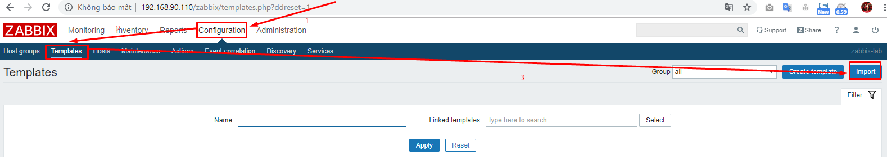
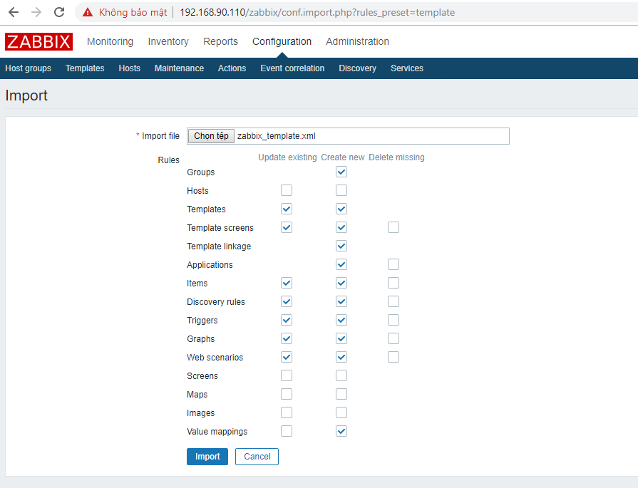
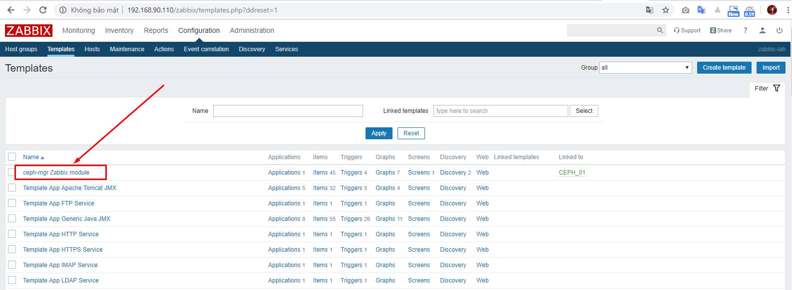
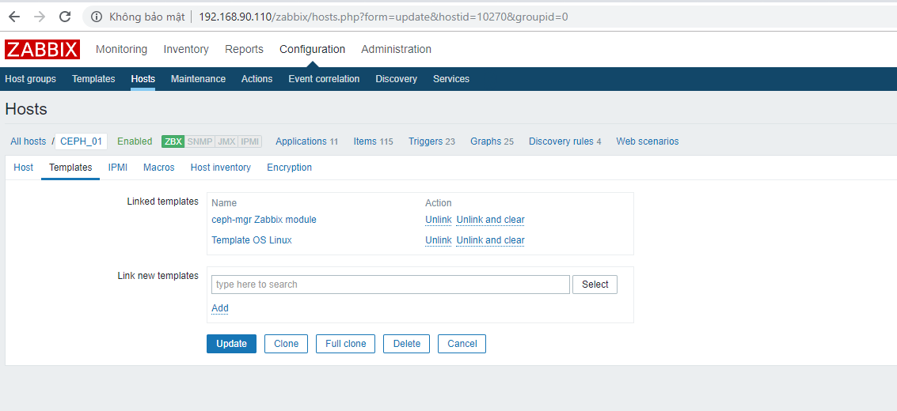
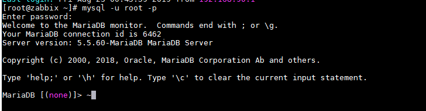
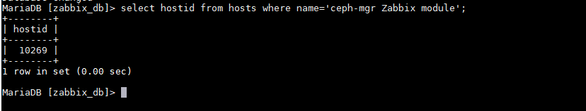
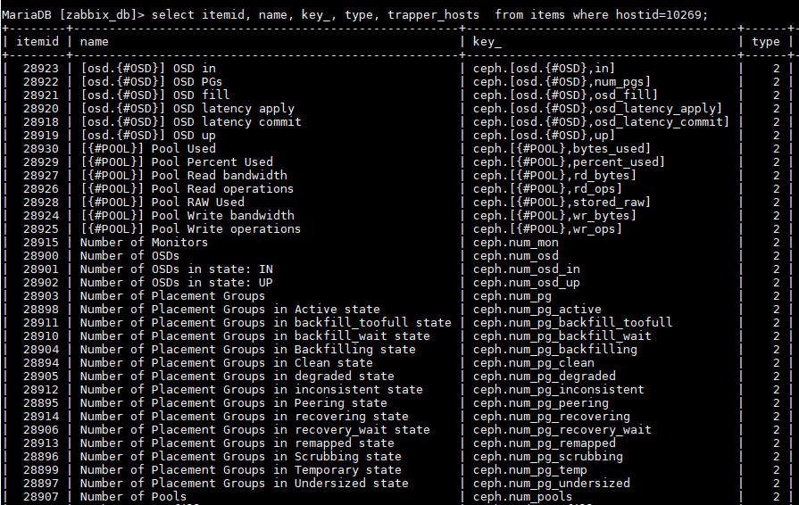
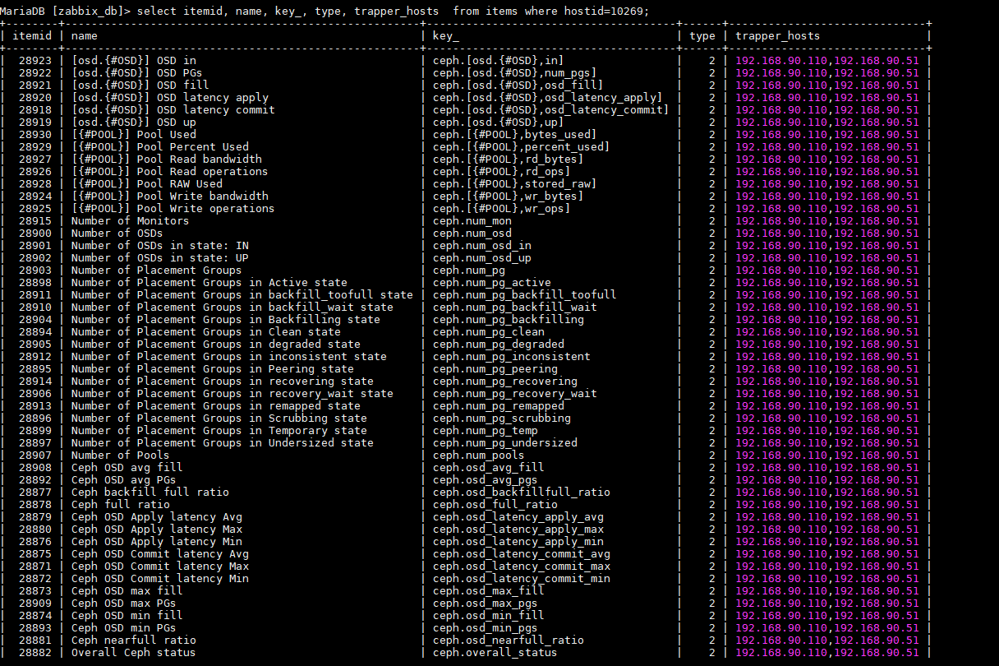
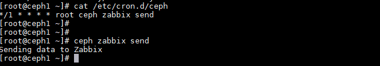
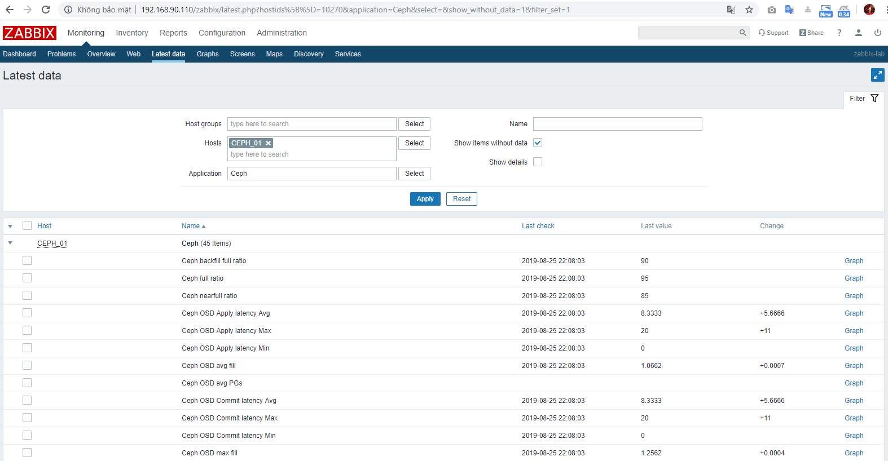

# Ghi chép một số bước monitor CEPH bằng phần mềm zabbix - grafana

### Mục lục

[1. Mô hình](#mohinh)<br>
[2. IP Planning](#planning)<br>
[3. Thao tác trên node CEPH](#nodeceph)<br>
[4. Thao tác trên node zabbix](#nodezabbix)<br>
[5. Test](#test)<br>
[6. Import graph grafana](#grafana)<br>

<a name="mohinh"></a>
## 1. Mô hình triển khai

Mô hình triển khai gồm

+ 01 cụm CEPH (192.168.90.51)<br>
+ 01 zabbix server (192.168.90.110)<br>
+ 01 grafana server(192.168.90.111)<br>

<a name="planning"></a>
## 2. IP Planning


<a name="nodeceph"></a>
## 3. Thao tác trên node CEPH

Thực hiện trên node CEPH cài service monitor của cụm CEPH


### Cài zabbix-sender

```
yum install zabbix-sender -y
```

Check

```
[root@nhcephssd1 ~]# which zabbix_sender
/usr/bin/zabbix_sender
```

### Setup module ceph-zabbix

+ Enable module ceph-zabbix

```
ceph mgr module enable zabbix
```

+ Set zabbix server

```
ceph zabbix config-set zabbix_host 192.168.90.110
```

+ Set ceph-server

```
ceph zabbix config-set identifier CEPH_01
```

+ Set zabbix_sender

Lấy đường dẫn
```
which zabbix_sender
```

```
ceph zabbix config-set zabbix_sender /usr/bin/zabbix_sender
```

+ Set port

```
ceph zabbix config-set zabbix_port 10051
```

+ Set interval time

```
ceph zabbix config-set interval 60
```

+ Show lại config

```
ceph zabbix config-show
```


<a name="nodezabbix"></a>
## 4. Thao tác trên node zabbix

+ Import zabbix_temaplte.xml

Download template <a href="https://github.com/domanhduy/ghichep/blob/master/DuyDM/Zabbix/scripts/zabbix-ceph/zabbix_template.xml" target="_blank">tại đây</a>!








+ Add host CEPH trên zabbix (nếu đã add rồi thì bỏ qua), add template ceph-zabbix vừa import ở trên cho node CEPH mon.




### Config database zabbix

+ Kết nối tới database zabbix

```
mysql -u root -p
```



+ Sử dụng database zabbix

```
show databases;
```

```
use zabbix_db;
```


+ Xác định ID template zabbix-ceph trong database

```
select hostid from hosts where name='ceph-mgr Zabbix module';
```

=> `10269`



```
select itemid, name, key_, type, trapper_hosts  from items where hostid=10269;
```



+ Define allow host zabbix, ceph mon.

```
update items set trapper_hosts='192.168.90.110,192.168.90.51' where hostid=10269;
```

Check lại update trapper_hosts



<a name="nodezabbix"></a>
## 5. Đặt crontab, check

### Ceph cron job trên CEPH server

```
vi /etc/cron.d/ceph
```

Chỉnh sửa

```
*/1 * * * * root ceph zabbix send
```

## Check

```
ceph zabbix send
```







